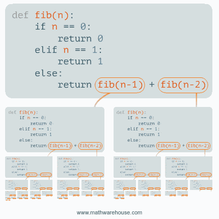

<!--
# Metadata
title: Algorithms
author: Seb Blair (CompEng0001)
description: Lecture slides on Algorithms
keywords: module handbook
lang: en

# Slide styling
theme: uog-theme
_class: lead title
paginate: true
_paginate: false
transition: fade 250ms

style: |
  header em { font-style: normal; view-transition-name: header; }
  header strong { font-weight: inherit; view-transition-name: header2; }
  header:not:has(em) { view-transition-name: header; }
  header:not:has(strong) { view-transition-name: header; }
-->

<style scoped>
h1 {
  view-transition-name: header;
  display: flex;
  align-items: center;
  margin: 0 auto;
}
</style>

# Algorithms

<div align=center style="font-size:76px; padding-left:300px;padding-right:300px;" >

```py
module = Module(
    code="ELEE1147",
    name="Programming for Engineers",
    credits=15,
    module_leader="Seb Blair BEng(H) PGCAP MIET MIHEEM FHEA"
)
```

</div>

<!-- _footer: "[Download as a PDF](https://github.com/UniOfGreenwich/ELEE1147_Lectures/raw/main/content/Algorithms/Algorithms.pdf)" -->

---

<style scoped>
h1 { view-transition-name: header2; }
</style>

<!-- header: "_Algorithms_" -->
<!-- class: lead -->

<div>

## O Notation

- **Big-O Notation (O-notation):**
  -  Represents the upper bound of the running time of an algorithm. 
  - Shows the worst-case complexity of an algorithm. 
<br>
- **Omega Notation (Ω-notation):**
  -  Represents the lower bound of the running time of an algorithm. 
  -  Provides the best case complexity of an algorithm. 
<br>
- **Theta Notation (Θ-notation):** 
  - Theta notation encloses the function from above and below. 
  - Used for analysing the average-case complexity of an algorithm.

---

<div style="padding-bottom:100px">

## Why Big O?

</div>

<div>

**Importance:**

- Efficient algorithms are crucial in computer science and programming.
<br>
- Big O helps in quantifying and comparing algorithm efficiency.
<br>
- Allows for better decision-making in algorithm selection.

</div>

---

<div style="padding-bottom:50px">

## Analysing Algorithm Complexity

</div>

<div>

<br>

**Factors Affecting Complexity:**

<br>

- **Time Complexity:** 
  - How the runtime of an algorithm increases with the input size.

<br>

- **Space Complexity:** 
  - How the memory requirements of an algorithm scale with the input size.

</div>

---

<div style="padding-bottom:50px">

## Time Complexity

</div>

<div>

Time complexity represents the amount of time an algorithm takes to complete as a function of the input size.
<br>
- Constant Time $\Longrightarrow O(1)$
<br>
- Logarithmic Time $\Longrightarrow O(log\ n)$
<br>
- Linear Time $\Longrightarrow  O(n)$
<br>
- Log-linear Time $\Longrightarrow  O(n\ log\ n)$
<br>
- Quadratic Time $\Longrightarrow  O(n^2)$

- ...

</div>

---

## Time Complexity Metrics

<div align=center style="font-size:28px">

| Big O Notation | $n$ | $n\ log\ n$ | $n^2$ | $n^3$ | $2^n$ | $n!$ | 
|---|---|---|---|---|--|----|
|n = 10       | < 1 sec |< 1 sec |< 1 sec |< 1 sec |< 1 sec | 4 sec | 
|n = 30       | < 1 sec |< 1 sec |< 1 sec |< 1 sec |< 18 min | $10^{25}$ years|
|n = 100      | < 1 sec |< 1 sec |< 1 sec |1s      |$10^{17}$ years|Very Long Time|
|n = 1000     |< 1 sec |< 1 sec |1 sec |18 min  |Very Long Time|Very Long Time|
|n = 10,000   |< 1 sec |< 1 sec |2 min |12 days    |Very Long Time|Very Long Time|
|n = 100,000  |< 1 sec |2 sec |3 hours |32 years |Very Long Time|Very Long Time|
|n = 1,000,000|1 sec |20 sec |12 days |31,710 years    |Very Long Time|Very Long Time|

</div>

<!-- 
- 2^128 340 undecillion
- 2^92 grams earth 
-->

---

<div style="padding-bottom:50px">

## Space Complexity

</div>

<div>

Space complexity represents the amount of memory space an algorithm requires as a function of the input size.

<br>

- Constant Space $\Longrightarrow O(1)$
<br>
- Linear Space $\Longrightarrow O(n)$
<br>
- Log-linear Space $\Longrightarrow O(n\ log\ n)$
<br>
- Quadratic Space $\Longrightarrow O(n^2)$
<br>
- ...

</div>

---

<div>

##  Recogonising Algorithms Complexity

</div>

<div style="font-size:28px">
<br>

- Constant runtime is represented by $O(1)$
- linear growth is $O(n)$
- logarithmic growth is $O(log\ n)$
- log-linear growth is $O(n\ log\ n)$
- quadratic growth is $O(n^2)$
- exponential growth is $O(2^n)$
- factorial growth is $O(n!)$ 

</div>


---

## Table of Big O

<div align=center style="font-size:18px">

| Big O Notation | Relationship with 'n'            | Description                                       | Assumption                           |
|----------------|----------------------------------|---------------------------------------------------|-------------------------------------|
| O(1)           | Constant                         | The algorithm's runtime is constant regardless of the input size. | The algorithm performs a single operation. |
| O(log n)       | Logarithmic                      | The algorithm's runtime grows logarithmically as the input size increases. | The algorithm divides the input in half at each step (e.g., binary search). |
| O(n)           | Linear                           | The algorithm's runtime grows linearly with the input size. | The algorithm iterates through the input once. |
| O(n log n)     | Linearithmic                     | The algorithm's runtime grows in between linear and logarithmic as the input size increases. | Typically seen in efficient sorting algorithms like merge sort or quicksort. |
| O(n^2)         | Quadratic                        | The algorithm's runtime grows quadratically with the input size. | The algorithm has nested iterations over the input (e.g., nested loops). |
| O(n^3)         | Cubic                            | The algorithm's runtime grows cubically with the input size. | The algorithm has triple nested iterations over the input. |
| O(2^n)         | Exponential                      | The algorithm's runtime grows exponentially with the input size. | The algorithm performs exhaustive search or generates all subsets of the input. |

</div>

---

<div class="columns-2">
<div style="font-size:28px">

$O(1)$

- The function takes two integers as input.
<br>
- It performs a single addition operation: a + b.
<br>
- It returns the result.
<br>
- No loops, recursion, or data-dependent iteration is involved.
<br>
- The time to execute is always the same, regardless of the values of a and b.

</div>
<div style="padding-top:300px">

```c
int add(int a, int b){
  return a + b;
}
```
</div>
</div>

---

<div class="columns-2">
<div style="font-size:28px">

$O(n)$ 

- The function iterates through the array once, from index 0 to size - 1.
<br>
- For each element, it performs one multiplication.
<br>
- So, if size = n, the loop runs n times ⇒ time complexity is linear:


  $\hspace{8em} 𝑇(𝑛)\ =\ 𝑐\ ⋅\ 𝑛\ ⇒\ 𝑂( 𝑛 )$

- This means the execution time increases linearly with the number of elements in the array.

</div>
<div style="padding-top:200px">

```c
int prod(int[] array, int size){
    product = 1;
    for (int i =0; i < size){
        product *= array[i];
    }
    return product;
}
```

</div>
</div>

---

<div>

## Real-world Applications

</div>

<div>

- Choosing the right data structures and algorithms for software development.
<br>

- Optimizing database queries.

<br>

  ||Seach in a table|Seach in an index|
  |---|---|---|
  |Seach Algorithm| Linear Scan|Binary Scan|
  | Complexity| $O (N)$|$O\ (Log\ N)$|

<br>

- Designing efficient algorithms for large-scale data processing.

</div>

<!-- _footer:  https://under-the-hood.dev/blog/databases/database-indexes-complexity/ -->

---

<div>

## Examples of Big O Notation

</div>

<div>

<br>
<br>

- Linear Search $\Longrightarrow O(n)$
<br>
- Binary Search $\Longrightarrow O(log\ n)$
<br>
- Bubble Sort $\Longrightarrow O(n^2)$
<br>
- Merge Sort $\Longrightarrow O(n\ log\ n)$
<br>
- ...

</div>

<!--
- This is worth knowing for coding interviews
-->
---

<div>

## Linear Search Example, $O(n)$:

</div>

<div class="columns-2" style="padding-top:100px">
<div style="padding-top:175px">

<br>

- Searching for a value and its index

<br>

- Unordered List, Small Data Sets, Linked Lists.

</div>

<div style="font-size:28px; margin-top:0px">

```c
#include <stdio.h>

int linearSearch(int arr[], int size, int target) {
    for (int i = 0; i < size; i++) {
        if (arr[i] == target) {
            return i;  // Target found
        }
    }
    return -1;  // Target not found
}
```

```c
int main() {
    int arr[] = {3, 1, 4, 8, 5, 9, 7, 2, 6, 0};
    int size = sizeof(arr) / sizeof(arr[0]);
    int target = 4;

    int result = linearSearch(arr, size, target);

    if (result != -1) {
        printf("Target %d found at index %d\n", target, result);
    } else {
        printf("Target %d not found\n", target);
    }

    return 0;
}
```

</div>
</div>

---

<div style="padding-bottom:100px">

## Second example of $O(n)$, finding Max:

</div>

<div class="columns-2">
<div style="font-size:28px;padding-top:10px">

- The algorithm's time complexity is linearly dependent on the size of the input (each additional element in the array results in one more iteration through the loop)
<br>
- it is denoted as **$O(n)$**, where $n$ is the length of the array. This makes it an efficient linear time algorithm for finding the maximum element in an array.

</div>
<div>

```c
// Linear complexity: O(n)
int FindMaxElement(int[] array)
{
  int max = int.MinValue;
  for (int i = 1; i < array.Length; i++)
  {
    if (array[i] > max)
    {
      max = array[i];
    }
  }
  return max;
}
```

</div>
</div>

---

<div style="padding-bottom:50px">

## Binary search $O(log\ n)$ code example:

</div>

<div class="columns-2">
<div>

```c
int main() {
    int arr[] = {5,11,12,14,15,18,19,21,23,
                    27,25,28,30,32,37};
    int size = sizeof(arr) / sizeof(arr[0]);
    int target = 27;

    int result = binarySearch(arr, size, target);

    if (result != -1) {
        printf("Target %d found at index %d\n", 
                  target, result);
    } else {
        printf("Target %d not found\n", target);
    }

    return 0;
}
```

</div>

<div>

```c
#include <stdio.h>

int binarySearch(int arr[], int size, int target) {
    int low = 0, high = size - 1;

    while (low <= high) {
        int mid = (low + high) / 2;
        if (arr[mid] == target) {
            return mid;  // Target found
        } else if (arr[mid] < target) {
            low = mid + 1;
        } else {
            high = mid - 1;
        }
    }

    return -1;  // Target not found
}
```

<div>
<div>

---

## Binary search $O(log\ n)$ and Linear(Seq) Search $O(n)$

 


---

<div>

## Exponential growth is $O(2^n)$, Fibonacci:

</div>

<br>

- An algorithm's performance can degrade rapidly as the input size increases.

<div class="columns-2">
<div style="padding-top:50px">



</div>

<div style="font-size:28px; padding-top:150px">

```c
// Exponential complexity: O(2^n)
long Fibonacci(int n)
{
    if (n == 0)
    {
        return 1;
    }
    else if (n == 1)
    {
        return 1;
    }
    else
    {
        return Fibonacci(n - 1) + Fibonacci(n - 2);
    }
}
```

</div>
</div>

<!--


The provided algorithm for calculating Fibonacci numbers has exponential time complexity, O(2^n). This is because, for each Fibonacci number, the algorithm makes two recursive calls: Fibonacci(n - 1) and Fibonacci(n - 2). This leads to an exponential growth in the number of recursive calls as the input n increases.

To break it down:

For Fibonacci(n - 1), it makes two more calls for Fibonacci(n - 2) and Fibonacci(n - 3).
For Fibonacci(n - 2), it makes two more calls for Fibonacci(n - 3) and Fibonacci(n - 4).
This pattern continues, and you can see that the number of recursive calls doubles with each level of recursion.
As a result, the time complexity is O(2^n), where n is the input to the Fibonacci function. This exponential growth makes the algorithm inefficient for larger values of n, and more efficient algorithms, like memoization or dynamic programming, are often used to improve the time complexity.

-->

---

<div>

## Binary Search $O(log\ n)$

</div>

<div class="columns-2">
<div style="font-size:28px;">

```c
int array[] = {1, 3, 5, 7, 9, 11, 13};
int size = 7;
int target = 9;

binary_search(array, 7, 9);
```

<br>

- Each iteration halves the search range.

- If you start with n elements:

  - After 1 step: n/2

  - After 2 steps: n/4

  - After 3 steps: n/8

  - …

  - Until the size becomes 1

- The number of steps is proportional to $log_2(𝑛)$:

    $\hspace{2em}\ log_2(7)\ \approx \ 2.8\ ⇒$ Rounded up to 3 iterations

</div>
<div style="font-size:30px">

```c
int binary_search(int array[], int size, int target) {
    int left = 0;
    int right = size - 1;

    while (left <= right) {
        int mid = left + (right - left) / 2;
        if (array[mid] == target)
            return mid;
        else if (array[mid] < target)
            left = mid + 1;
        else
            right = mid - 1;
    }

    return -1; // Not found
}
```

</div>
</div>

<!--
- Ensure that a is greater than b. If b is greater than a, swap the values of a and b.
- Compute the remainder r of a divided by b.
- If r is equal to 0, then the GCD of a and b is b. Otherwise, set a to b and b to r, and go back to step 2.
-->
---

<div>

## Binary Search $O(log\ n)$

</div>

<div class="columns-2">
<div>

```c
int array[] = {1, 3, 5, 7, 9, 11, 13};
int size = 7;
int target = 9;

binary_search(array, 7, 9);
```

<br>

<div style="font-size:22px;">

- Initial values:

  - `left` = `0`

  - `right` = `6` (since size = 7)

  - `target` = `9`

- Iteration 1:

  - `mid = 0 + (6 - 0) / 2 = 3`

  - `array[mid] = array[3] = 7`

  - `7 < 9`, so discard the `left` half (including `mid`).

  - Update: `left = mid + 1 = 4`

</div>
</div>
<div style="font-size:30px">

```c
int binary_search(int array[], int size, int target) {
    int left = 0;
    int right = size - 1;

    while (left <= right) {
        int mid = left + (right - left) / 2;  // Prevents overflow
        if (array[mid] == target)
            return mid;
        else if (array[mid] < target)
            left = mid + 1;
        else
            right = mid - 1;
    }

    return -1; // Not found
}
```

</div>
</div>

<!--
- Ensure that a is greater than b. If b is greater than a, swap the values of a and b.
- Compute the remainder r of a divided by b.
- If r is equal to 0, then the GCD of a and b is b. Otherwise, set a to b and b to r, and go back to step 2.
-->
---

<div>

## Binary Search $O(log\ n)$

</div>

<div class="columns-2">
<div>

```c
int array[] = {1, 3, 5, 7, 9, 11, 13};
int size = 7;
int target = 9;

binary_search(array, 7, 9);
```

<br>

<div style="font-size:22px;">

- Iteration 2:

  - `mid = 4 + (6 - 4) / 2 = 5`

  - `array[mid] = array[5] = 11`

  - `11 < 9`, so discard the `right` half (including `mid`).

  - Update: `right = mid - 1 = 4`

- Iteration 3:
  
  - `mid = 4 + (4 - 4) / 2 = 4`

  - `array[mid] = array[4] = 9`

  - Return `4` (index of target)

</div>
</div>
<div style="font-size:30px">

```c
int binary_search(int array[], int size, int target) {
    int left = 0;
    int right = size - 1;

    while (left <= right) {
        int mid = left + (right - left) / 2;  // Prevents overflow
        if (array[mid] == target)
            return mid;
        else if (array[mid] < target)
            left = mid + 1;
        else
            right = mid - 1;
    }

    return -1; // Not found
}
```

</div>
</div>

<!--
- Ensure that a is greater than b. If b is greater than a, swap the values of a and b.
- Compute the remainder r of a divided by b.
- If r is equal to 0, then the GCD of a and b is b. Otherwise, set a to b and b to r, and go back to step 2.
-->
---

##  Bubble Sort $\Longrightarrow O(n^2)$:

```c
for (c = 0 ; c < n - 1; c++)
  {
    for (d = 0 ; d < n - c - 1; d++)
    {
      if (array[d] > array[d+1])
      {
        swap       = array[d];
        array[d]   = array[d+1];
        array[d+1] = swap;
      }
    }
  }
```


--- 

## Quick Sort $\Longrightarrow O(n\ log\ n)$:

<div style="font-size:20px">

```c
void quicksortMiddle(int arr[], int low, int high) {
  if (low < high) {
    // Selecting the middle element as the pivot
    int pivot = arr[(low + high) / 2]; 
    int i = low,j = high, temp;

    while (i <= j) {
      // Moving elements smaller than pivot to the left
        while (arr[i] < pivot) i++; 
        // Moving elements greater than pivot to the right
        while (arr[j] > pivot) j--; 

        if (i <= j) {
            temp = arr[i]; // Swapping elements        
            arr[i] = arr[j];
            arr[j] = temp;
            i++;
            j--;
        }
    }
    // Recursively sort the two partitions
    if (low < j) quicksortMiddle(arr, low, j);
    if (i < high) quicksortMiddle(arr, i, high);
  }
}
```

</div>


<!--
sorting algorithm based on the divide and conquer approach

https://hackr.io/blog/quick-sort-in-c
-->


---

<div style="padding-bottom:100px">

## Some Funny Algorithms

</div>

<div class="columns-2">
<div style="padding-top:200px;padding-left:200px;font-size:32px">

- Bogosort

</div>
<div style="padding-right:200px;font-size:32px">

```py
from random import shuffle

def sort(list):
    while not is_sorted(nums):
      shuffle(nums)
    return nums

def is_sorted(nums):
    for i in range(1, len(nums)):
      if nums[i] < nums[i-1]:
          return False
      return True

# Example usage:
arr = [3, 1, 2, 5, 4, 6]
sorted_arr = sort(arr)
print(sorted_arr)
```

</div>
</div>

---

<div style="padding-bottom:100px">

## Some Funny Algorithms

</div>

<div class="columns-2">
<div style="padding-top:200px;padding-left:200px;font-size:32px">

- Stalin sort

</div>
<div style="padding-right:200px;font-size:32px">

```py
def stalin_sort(arr):
    if not arr:
        return arr
    sorted_arr = [arr[0]]
    for i in range(1, len(arr)):
        if arr[i] >= sorted_arr[-1]:
            sorted_arr.append(arr[i])
    return sorted_arr

# Example usage
arr = [3, 1, 4, 1, 5, 9, 2, 6, 5, 3, 5]
sorted_arr = stalin_sort(arr)
print("Sorted array:", sorted_arr)

Sorted array: [3, 4, 5, 9]
```

</div>
</div>