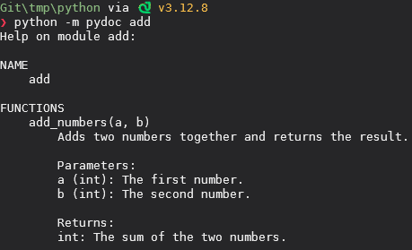

<!--
# Metadata
title: Code Conventions and Documentation
author: Seb Blair (CompEng0001)
description: Lecture slides on Code Conventions and Documentation
keywords: module handbook
lang: en

# Slide styling
theme: uog-theme
_class: lead title
paginate: true
_paginate: false
transition: fade 250ms

style: |
  header em { font-style: normal; view-transition-name: header; }
  header strong { font-weight: inherit; view-transition-name: header2; }
  header:not:has(em) { view-transition-name: header; }
  header:not:has(strong) { view-transition-name: header; }
-->

<style scoped>
h1 {
  view-transition-name: header;
  display: flex;
  align-items: center;
  margin: 0 auto;
}
</style>

# Code Conventions and Documentation

<div align=center style="font-size:76px; padding-left:300px;padding-right:300px;" >

```py
module = Module(
    code="ELEE1147",
    name="Programming for Engineers",
    credits=15,
    module_leader="Seb Blair BEng(H) PGCAP MIET MIHEEM FHEA"
)
```

</div>

<!-- _footer: "[Download as a PDF](https://github.com/UniOfGreenwich/ELEE1147_Lectures/raw/main/content/ReproducibleDevEnv/ReproducibleDevEnv.pdf)" -->

---

<style scoped>
h1 { view-transition-name: header2; }
</style>

<!-- header: "_Code Conventions and Documentation_" -->
<!-- class: lead -->

<div>

## Naming Conventions

<div class="columns-2">
<div style="padding-top:50px;font-size:28px">

- Lower case : `publicdomiansoftware`
  - elements and attributes
<br>
- Upper case : `PUBLICDOMAINSOFTWARE`
  - Naming constants
<br>
- Camel Case : `publicDomainSoftware`
  - local variable names
<br>
- Pascal Case : `PublicDomainSoftware` 

</div>

<div style="font-size:28px">

- Snake Case : `public_domain_software`
  -  C/C++ standard library names
<br>
- Screaming Snake Case :  `PUBLIC_DOMAIN_SOFTWARE`
  - Naming Constants

- Kebab Case : `public-domain-software`
  - class names, ids
<br>  
- Screaming Kebab Case :  `PUBLIC-DOMAIN-SOFTWARE`
  - Macros
  
</div>
</div>

---

## VS C Convention


<div class="columns-2">
<div>


```c
#include <stdio.h>

// Macros
#define MAX(a, b) ((a) > (b) ? (a) : (b))
#define MIN(a, b) ((a) < (b) ? (a) : (b))

// Global variables
int globalVariableOne;
int globalVariableTwo;

// Function prototypes
void InitializeGlobals();
int AddNumbers(int a, int b);

int main() {
    // Local variables
    int localVariable;

    // Initialize global variables
    InitializeGlobals();

    // Assign values to local variables
    localVariable = AddNumbers(globalVariableOne, globalVariableTwo);

    // Using macros
    printf("Max: %d\n", Max(globalVariableOne, localVariable));
    printf("Min: %d\n", Min(globalVariableTwo, localVariable));

    return 0;
}
...
```

</div>

<div style="padding-top:200px">

```c
...
// Function definitions
void InitializeGlobals() {
    globalVariableOne = 5;
    globalVariableTwo = 10;
}

int AddNumbers(int a, int b) {
    // This comment explains the function behavior
    return a + b;
}
```
</div>

---
<div style="padding-top:50px">

## Other conventions

</div>

<div style="padding-top:50px">

**GNU C:**
- Naming: Typically follows the lowercase with underscores for variables and functions (e.g., `my_variable`,` my_function()`).
- Indentation: Uses spaces for indentation (often 2 or 4 spaces).
- Brace Style: Opening braces are usually on the same line as the statement, following the Kernighan and Ritchie style.

<br>

**GCC (GNU Compiler Collection):**
- Similar to the GNU C conventions.
- It may include additional guidelines for contributing to the GCC codebase.

</div>

---

<div style="padding-top:50px">

## Other conventions

</div>

<div style="padding-top:50px">

**LLVM:**
- Naming: Uses camelCase for function names and lowercase with underscores for variable names (e.g., `myVariable`, `my_function()`).
- Indentation: Typically 2 spaces.
- Brace Style: Opening braces are on the same line.

<br>

**Microsoft Visual Studio C++:**
- Naming: Uses PascalCase for function and method names, and camelCase for variable names (e.g., `MyFunction()`, `myVariable`).
- Indentation: Typically 4 spaces.
- Brace Style: Opening braces are on the same line.

</div>

---

<div style="padding-top:50px">

## Other conventions

</div>

<div style="padding-top:50px">

**Google C++ Style Guide:**
- Naming: Uses camelCase for variable names, and underscores for function names (e.g., `myVariable`,` my_function()`).
- Indentation: Typically 2 spaces.
- Brace Style: Opening braces are on the same line.

<br>

**Mozilla C++ Coding Style:**
- Naming: Uses camelCase for variable names and function parameters, and PascalCase for function names (e.g., `myVariable`, `MyFunction()`).
- Indentation: Typically 2 spaces.
- Brace Style: Opening braces are on the same line.

</div>

---

<div style="padding-top:50px">

## Other conventions

</div>

<div style="padding-top:50px">

**Linux Kernel Coding Style:**
- Naming: Uses lowercase with underscores for variables and functions (e.g., `my_variable`, `my_function()`).
- Indentation: Typically 8 spaces.
- Brace Style: Opening braces are on the same line.

</br>

**Qt Coding Style:**
- Naming: Uses camelCase for variables and functions (e.g., `myVariable`, `myFunction()`).
- Indentation: Typically 4 spaces.
- Brace Style: Opening braces are on the same line.


</div>

--- 

## Documentation, 'doc as you go...'

<div style="font-size:28px">

**Why Documentation**

- **You**
  - put down the project and return to it much later
  - want people to use it and give you credit
- **Others**
  - would be encouraged to contribute
  - more easily use your code
- **Science / Engineering**
  - Advances
  - Open collaboration
  - Reproducibility and transparency

</div> 


---

## Tools for Documentantion

<div style="font-size:27px">

- **Python**
  - Sphinx, Doctest, Numpydoc
- **R**
  - R Markdown, Kite
- **C++**
  - BoostBook, QuickBook, GhostDoc
- **Java**
  - Javadoc
- **Ruby**
  - Docurium
- **Doxygen**
  - r, C, C#, PHP, Java, Python, and Fortran.

</div>


---

## Divergence Dilemma

- As with all documentation code develops faster and is released, thus creates a divergence, as in code <-> documentation become out of sync.


<!--
Typically source code and documentation are not written in parallel but sequentially. 

First the source code is developed and later some documentation is added. Whenever bugs in the source code must be fixed or additional features are added, very often the documentation is not updated. 

Hence the documentation is no longer describing the current version of the source code, but still reflects the initial version of the software program.
-->

---

## Literate Programming
-  a computer program is given as an explanation of how it works in a natural language, such as English, interspersed (embedded) with snippets of macros and traditional source code, from which compilable source code can be generated.


---

## Doxygen syntax

<div class="columns-2">
<div>

```c
//**
 * @file calculator.c
 * @brief Simple calculator program with basic operations.
 */

#include <stdio.h>

/**
 * @brief Adds two numbers.
 * @param a The first operand.
 * @param b The second operand.
 * @return The sum of a and b.
 */
int add(int a, int b) {
    return a + b;
}

/**
 * @brief Subtracts two numbers.
 * @param a The first operand.
 * @param b The second operand.
 * @return The result of subtracting b from a.
 */
int subtract(int a, int b) {
    return a - b;
}
```

</div>

<div style="padding-top:150px">

```c
/**
 * @brief Main function to demonstrate calculator operations.
 * @return 0 if successful, otherwise an error code.
 */
int main() {
    int num1, num2;
    
    printf("Enter two numbers: ");
    scanf("%d %d", &num1, &num2);

    printf("Sum: %d\n", add(num1, num2));
    printf("Difference: %d\n", subtract(num1, num2));

    return 0;
}

```
</div>

</div>

---

## Example output

<div class="columns-2">
<div style="font-size:19px; padding-left:200px" >

```c
//**
 * @file calculator.c
 * @brief Simple calculator program with basic operations.
 */

#include <stdio.h>

/**
 * @brief Adds two numbers.
 * @param a The first operand.
 * @param b The second operand.
 * @return The sum of a and b.
 */
int add(int a, int b) {
    return a + b;
}

/**
 * @brief Subtracts two numbers.
 * @param a The first operand.
 * @param b The second operand.
 * @return The result of subtracting b from a.
 */
int subtract(int a, int b) {
    return a - b;
}
```

```c
/**
 * @brief Main function to demonstrate calculator operations.
 * @return 0 if successful, otherwise an error code.
 */
int main() {
    int num1, num2;
    
    printf("Enter two numbers: ");
    scanf("%d %d", &num1, &num2);

    printf("Sum: %d\n", add(num1, num2));
    printf("Difference: %d\n", subtract(num1, num2));

    return 0;
}

```

</div>

<div style="padding-left:200px">


</div>

</div>

---

<div>

## Doxygen Configuration file

</div>

<div class="columns-2">
<div style="padding-top:200px">

```sh
PM> doxygen.exe doxygenConfigFile
```

</div>
<div>

```
# Doxyfile for calculator.c

DOXYFILE_ENCODING      = UTF-8
PROJECT_NAME           = "Calculator Documentation"
PROJECT_NUMBER         = 1.0
PROJECT_BRIEF          = "A simple calculator program with basic operations."

OUTPUT_DIRECTORY       = ./docs
CREATE_SUBDIRS         = NO

INPUT                  = calculator.c
RECURSIVE              = NO

EXTRACT_ALL            = YES
EXTRACT_PRIVATE        = YES
EXTRACT_STATIC         = YES
EXTRACT_LOCAL_CLASSES  = YES

GENERATE_LATEX         = NO
GENERATE_HTML          = YES
```

</div>


---

## Python Documentation Generators

- Sphinx
    - Python, Linux Kernel and Project Jupter
- MkDocs
  -  a fast, simple and downright gorgeous static site generator that's geared towards building project documentation. 
- Doxygen
- Pydoc
- Pydoctor

---

## `pydoc` (`builtin`)

```py
def add_numbers(a, b):
    """
    Adds two numbers together and returns the result.
    
    Parameters:
    a (int): The first number.
    b (int): The second number.
    
    Returns:
    int: The sum of the two numbers.
    """
    return a + b
```



---

## Sphinx 

- GitHub link -> [https://github.com/sphinx-doc/sphinx](https://github.com/sphinx-doc/sphinx)
- Webpage -> [https://www.sphinx-doc.org/en/master/](https://www.sphinx-doc.org/en/master/)
- is a third-party tool
- Prefered tool for Python, Linux Kernel and Project Jupyter


---

## Sphinx 


<div class="columns-2">
<div>

`add.py`

```py
def add_numbers(a, b):
    """
    Adds two numbers together and returns the result.

    :param a: The first number.
    :type a: int
    :param b: The second number.
    :type: b: int

    returns: The sum of the two numbers.
    rtype: int
    """
    return a + b
```


</div>
<div>

`conf.py`
```
project = 'adding'
copyright = '2025, Seb Blair'
author = 'Seb Blair'
release = '0.1'

extensions = []

templates_path = ['_templates']
exclude_patterns = []

html_theme = 'alabaster'
html_static_path = ['_static']
```

</div>
</div>