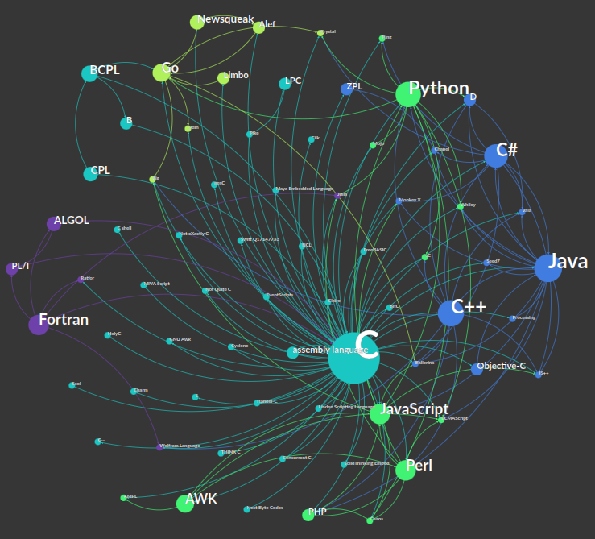
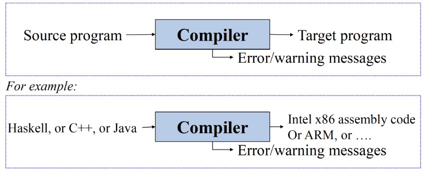
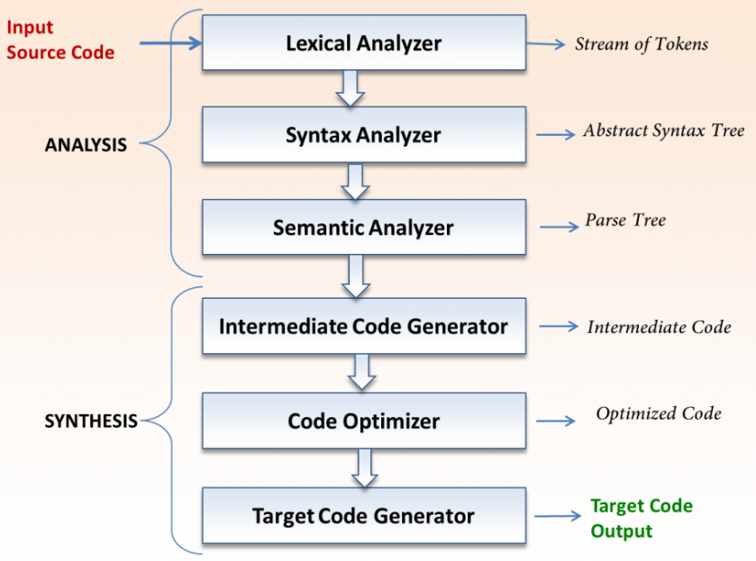
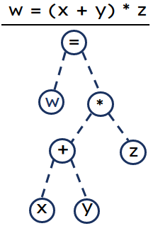

<!-- _footer: "[Download as a PDF](https://github.com/UniOfGreenwich/ELEE1147_Lectures/raw/gh-pages/content/Compiler/Compiler.pdf){:target="_blank"}" -->

# Compliers

    Module Code: U10793

    Module Name: Fundamentals of Computer Systems

    Credits: 15

    Module Leader: Seb Blair BEng(H) PGCAP MIET MHIEEM FHEA
---


---

## What we will cover

1. We will understand how ‘high’ and ‘low’ level programming languages are compiled to machine code so that it controls the hardware.​


1. We will compare a number of programming languages and how they compile to machine code.​

---

## What is programming?

<details>
<summary>?</summary>
<p></p>

- A programming language is a computer language programmers use to develop software programs, scripts, or other sets of instructions for computers to execute​...

</details>


<details>
<summary>Why program?​</summary>

<p></p>

- Automate process​, Create digital records​, Communication ,Simulation/emulation​, …​

- But ultimately programming provides instructions on how hardware is controlled, remember at the end of the day it is all zeroes and ones that represent electrical signals.​

</details>

---

## Programming Paradigms

- ~1605 programming lanaguages

- 94 Types

- 65 Paradigms


<!--
- High Level / low level – C#, Java, Python, Ruby, C, C++, assembly ​

- Declarative / imperative/procedural – SQL, Curl, Prolog​

- General-purpose/domain specific – HTML, Markdown/up, MATLAB​

- Object-orientated/concurrent – C#, Java, Python,​

- Command/complied/script language – batch, bash, Javascript​

- Answer set - Prolog

-->

---

## C Influences

[](https://programminglanguages.info/influence-network/#language=C)

<!--
Direct influences 60+ langauages
Python: 33
-->

---

## Human Language and Programming Languages


<details>

<summary>Are all programming languages in English?​</summary>

<p></p>

- No, but the vast majority are because they are the most used.​

</details>


<details>

<summary>Does it matter when these are compiled down to machine code?​</summary>

<p></p>

- No, because it’s all ones and zeroes​

</details>

---

## Some Examples of Non-English Programming Languages


**Linotte​**
It has been a developer for using French keywords, and its “Hello world” program looks like this:​

```vb
BonjourLeMonde:​
  début​
    affiche "Bonjour le monde!"​

------------------------

HelloWorld:​
  beginning
    poster "Hello world!
```
Has a web engine for HTML and PHP and JSP. 

---

**SAKO​**
System Automatycznego Kodowania Operacji (Automatic Operation Encoding System) programming language, which uses polish as for its keywords:​

```
LINIA​
  TEKST:​
  HELLO WORLD​
KONIEC​

---------------------------------

LINE
  TEXT:
  HELLO WORLD
END
```

Really only used in the late 1950s and early 1960s for the XYZ computers.

---

**Rapira​**

Rapira is another awesome example of non-english programming languages. It uses Russian keywords:​

```
ПРОЦ СТАРТ()​

    ВЫВОД: 'Привет, мир!'​

КОН ПРОЦ​

-------------------

proc start()
     output: 'Hello, world!!!';
end proc
```

---

**EPL**​

易语言 (Easy Programming Language, as known as EPL):​

<div style="font-size:25px">

```cshjarp
公开 类 启动类​
{​
  公开 静态 启动()​
  {​
    控制台.输出("你好，世界！");​
  }​
}
```
```c#
public class startup class​
{
  public static start()
  {
    console.output("Hello, World!");
  }
}
```

</div>

---

## Compiler

A compiler is a program that `processes` source code written in a programming language.

- **Program Processing:** A compiler serves as a crucial tool in handling programs written in various programming languages.

- **Program Generation:** It functions as a program generator, capable of producing executable programs in a specified language.

- **Language Translation:** The compiler translates programs written in one language into equivalent programs in another language.

---

 ## A tool to enable you to program at a higher level , by mapping high level concepts to low level implementation

- **Increased Productivity:** Allows for faster and more efficient development by focusing on the logic and design rather than intricate details.

- **Enhanced Readability:** Code becomes more readable and understandable, facilitating collaboration and maintenance.

- **Code Portability:** Encourages code portability by minimizing dependencies on specific hardware or architecture

---



- Translates from one language into another

- Output a low level program which behaves as specified by
the input, higher level program.

- Mediate between higher level human concepts, and the
word by word data manipulation which the machine performs.

---

## Compliler and Interpreter

<details>
<summary>Compiler?</summary>

<p></p>

- Compiler translates code from a high-level programming language (like Python, JavaScript or Go) into machine code **before the program runs**.

</details>

<details>
<summary>Interpreter?</summary>

<p></p>

- Interpreter translates code written in a high-level programming language into machine code **line-by-line as the code runs**.

</details>


---

## GCC compiler example


- `$ gcc -S -O test.c`

<div align=center>

<table style="font-size:29px">
<tr>
<td>

Input file `test.c`

```c
int A;
int B;
test_fun()
{
  A = b + 123;
}
```


</td>
<td>

Output file `test.out`
```asm
.comm _A,4
.comm _B,4
_test_fun:
pushl %ebp
movl %esp,%ebp 
movl _B,%eax 
addl $123,%_A
movl %ebp,%esp 
popl %ebp
ret
```
</td>
</td>
</table>

The flag `S` tells the compiler to produce assembly code, `O` turns optimisation on

</div>

---

## Assembly code

**Assembly code** is a `low-level` programming language that serves as an `interface` between `high-level` programming languages and the computer's `hardware`.

- **Human-Readable Machine Code**: Assembly code is a human-readable representation of machine code, making it more understandable than binary machine code.

- **Close to Hardware**: Unlike high-level languages, assembly code provides a direct correspondence to the architecture and operations of the underlying hardware.

---

## Symbolic Representation

-  Uses mnemonics and symbols to represent machine instructions, making it more comprehensible than raw machine code.

<div align=center>

|**Binary**|**Opcode**|**Mnemonic**|**Description**|
|---|---|---|---|
|1000 0111|87|`ADD A`|Add the contents of the register A to that of the accumulator|
|0011 1010| 3A| `LDA` | Load data stored in the given memory address|
|0111 1001|79|`MOV A C`| Move data from register A to C|
|1100 0011| C3|`JMP`| Jump to instruction in specified memory address|
|1100 0001| C1 |`POP` B|Pop from stack and copy to memory register B + C|

</div>

---

**Example:**

- The .data section declares a null-terminated string "Hello, Assembly!".
- The .text section contains the program logic.
- The _start label marks the entry point of the program.


---

## Compiling Code



---

## Lexical Analysis

The compiler begins converting the series of characters into tokens​

High Level Code​

<table>
<tr>
<td>

```c
int n = 11;​
float q = 1.618f;​
if (n < 12)
{​ 
  return q;​
}​
else​
{
  return n;
​}​
```

</td>
<td>

|Token name​|Example token values​|
|---|----|
|identifier|n, q​|
|keyword​|int, float, if, else, return, while| ​
|separator​|{ }, ( ),  [ ], ;​|
|operator​|+,- *, / , = ,< , >, : , ?​|
|literal​|True, false, 6.02e23, “string”​|
|comment​|// this is a comment /*this is another comment*/​|
</td>
</tr>
</table>

---

## Syntax Analysis

Syntax analysis is based on the rules based on the specific programming language by constructing the parse tree with the help of tokens. ​


<table>
<tr>
<td>
- Interior node: record with an operator filed and two files for children​

- Leaf: records with 2/more fields; one for token and other information about the token​

- Ensure that the components of the program fit together meaningfully​

- Gathers type information and checks for type compatibility​

- Checks operands are permitted by the source language​
</td>
<td>



</td>
</tr>
</table>

---

## Semantic Analyser

Semantic Analyser will check for Type mismatches, incompatible operands, a function called with improper arguments, an undeclared variable, etc.​

```c
int n = 11;​
float q = 1.618*n;​
```

In the above code, the semantic analyser will typecast the `int n 11` to `float 11.0` before multiplication​.

---

## Intermediate Code Generation

Removes unnecessary code lines​.

Arranges the sequence of statements to speed up the execution of the program without wasting resources. ​

Consider the following code, how can we remove unnecessary code? ​

<div style="font-size:24px">

```c
a = int_to_float(10)​
b = c * a​
d = e + b​
f = d​
```

<details>
<summary>Can become</summary> 

```c
b = c * 10.0​
f = e+b​
```
</details>

</div>

---

## Code Generation

The objective of this phase is to allocate **memory locations**, **storage** and **generate relocatable machine code** or **machine instructions**.​​

The code generated by this phase is executed to take inputs and generate expected outputs, therefore, checks for unreachable statements.​
Consider the following code, what error would be generated at this stage?​
```c
while (p == 10)​
{ ​
  break;​
  int q = (0.5*8)*p;​
}​
```

---
## Code Generation

Now we are going to see how we go from C to Assembly to machine code…​


<table>
<tr>
<td>

```c
int square(int num) {​
    return num * num;​
}
```
</td>
<td>

```as
square:​
  pushq  %rbp​
  movq   %rsp, %rbp​
  movl   %edi, -4(%rbp)​
  movl   -4(%rbp), %eax​
  imull  %eax, %eax​
  popq   %rbp​
  ret​
```
</td>

<td>

||Memory Addresses|
|---|---|
|rbp[3]​|0x0007556ff0e0|
|rbp[2]​|0x0007556ff0df​|
|rbp[1]​|0x0007556ff0de​|
|rbp[0]​|0x0007556ff0dd​|
||0x0007556ff0dc|
||0x0007556ff0db​|
||0x0007556ff0da​|
|num|0x0007556ff0d9​|​

</td>
</tr>
</table>

---

<div>

```c
int square(int num) {​
    return num * num;​
}
```
</div>

$\therefore$

<div class="grid grid-cols-2 gap-4">
<div>

```as
square:​
  pushq  %rbp​
  movq   %rsp, %rbp​
  movl   %edi, -4(%rbp)​
  movl   -4(%rbp), %eax​
  imull  %eax, %eax​
  popq   %rbp​
  ret​
```

</div>
<div>

```as
HEX
55           01010101​
48 89 e5​     01001000 10001001 11100101 ​
89 7d fc     10001001 01111101 11111100​
0f af c0​     00001111 10011111 11000000​
54           01010100 ​
C3           11000011​
```
</div>

---

## Symbol Management Table

A symbol table contains a record for each identifier with fields for the attributes of the identifier. 

<p align=center>

|Operation|Function|
|---|---|
|allocate| to allocate a new empty symbol table|
|free| to remove all entries and free storage of symbol table|
|lookup| to search for a name and return a pointer to its entry|
|insert| to insert a name in a symbol table and return a pointer to its entry|
|set_attribute| to associate an atrribute to a given entry|
|get_attribute| to get an attribute associated with a given entry|

</p>

---

## Error Handling Routine

During compilation process error(s) may occur in all the below-given phases:​

​
- Lexical analyser: Wrongly spelled tokens​
- Syntax analyser: Missing parenthesis​
- Semantic analyser: Mismatched data types, missing arguments​
- Intermediate code generator: Mismatched operands for an operator​
- Code Optimizer: When the statement is not reachable​
- Code Generator: Unreachable statements​
- Symbol tables: Error of multiple declared identifiers​

---

## Labs

Begin the lab from blackboard, where you are going experience programming in several languages <C , Python and Ada> to do similar operations, and see how the code compiles and the subsequent outputs!​