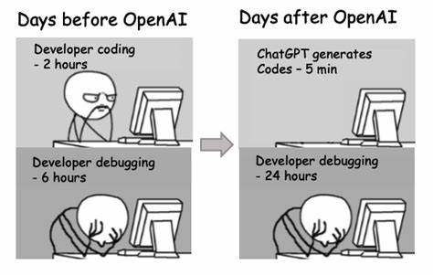
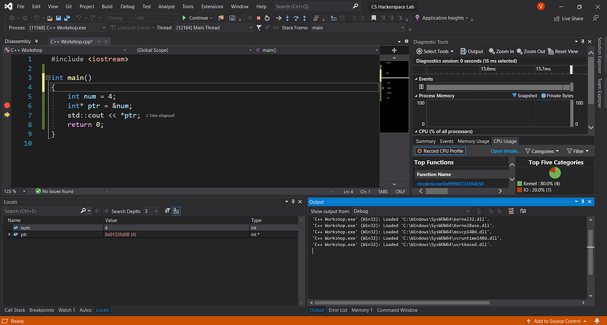
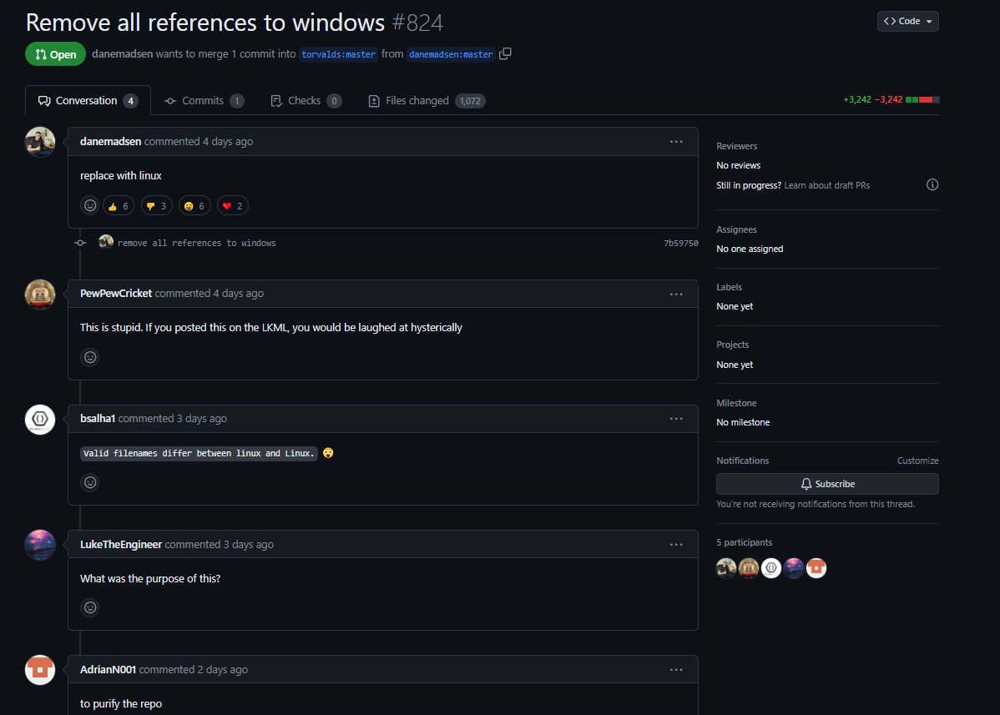
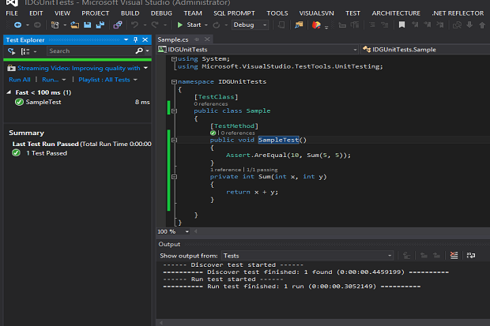
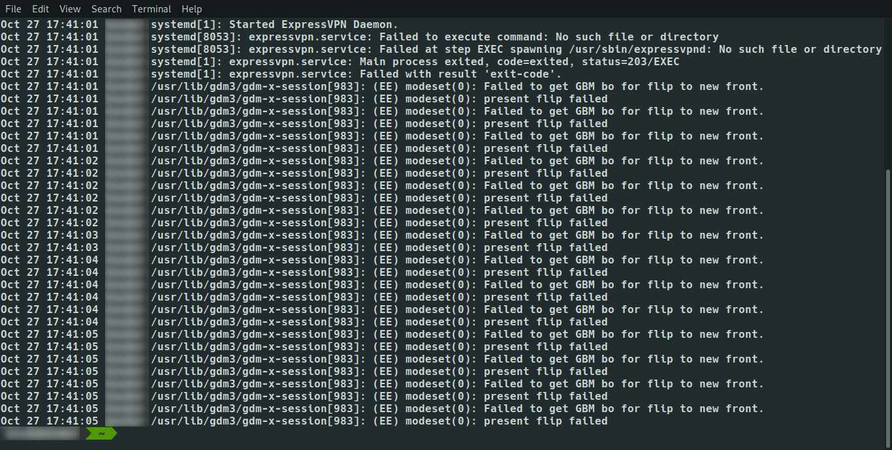

<!-- _footer: "[Download as a PDF](https://github.com/UniOfGreenwich/ELEE1147_Lectures/raw/gh-pages/content/Debugging/Debugging.pdf)" -->

# Debugging

    Module Code: ELEE1147
    
    Module Name: Programming for Engineers

    Credits: 15

    Module Leader: Seb Blair BEng(H) PGCAP MIET MIHEEM FHEA

---


## Introduction to Debugging

<div style="font-size:27px">

- Debugging is a crucial aspect of software development that involves identifying and fixing errors or defects (bugs) in computer programs. 

- Regardless of programming language or development environment, all software developers encounter bugs during the development process. 

- Debugging is the systematic process of locating and resolving these bugs to ensure that the software behaves as expected.

</div>



----

## Origin of Debugging?

<div style="font-size:28px">

Name: Admiral Grace Hopper (USN)
When: 1947 
How: Working on the Mark II computer in Harvard and discoved a moth stuck in one of the relays which was causing the errors in the computer... she remarked that she was "debugging" the computer. 

*she created the first compiler and contributed to the programming language COBOL

</div>


----

## Why Debugging Matters

- **Ensuring Software Quality**: Debugging helps improve the quality and reliability of software by identifying and fixing defects that could lead to unexpected behavior or system crashes.

- **Enhancing User Experience**: Software with fewer bugs provides a better user experience, leading to increased satisfaction and trust among users.

- **Reducing Development Costs**: Addressing bugs early in the development process helps reduce the time and resources required to fix them later, minimizing the overall cost of development.

- **Maintaining Developer Confidence**: Effective debugging techniques empower developers to tackle complex problems with confidence, enhancing their productivity and morale.

------

## Common Types of Bugs

- **Syntax Errors**: These occur when the code violates the syntax rules of the programming language, leading to compilation errors.

    ```c
    #include <stdio.h>

    int main() {
        int x = 5
        printf("The value of x is: %d\n", x);
        return 0;
    }
    ```

----

## Common Types of Bugs

- **Logic Errors**: Logic errors occur when the program does not produce the expected output due to flaws in its logic or algorithm.

   ```c
    #include <stdio.h>

    int main() {
        int x = 5;
        int y = 3;
        int sum = x - y;  // Logic error: subtracting instead of adding
        printf("The sum of x and y is: %d\n", sum);
        return 0;
    }
   ```


----

## Common Types of Bugs


- **Runtime Errors**: Runtime errors occur during program execution and can result in crashes or unexpected behavior, often caused by issues such as null pointer dereferences or array out-of-bounds access.

    ```c
    #include <stdio.h>

    int main() {
        int x = 5;
        int y = 0;
        int result = x / y;  // Runtime error: division by zero
        printf("The result is: %d\n", result);
        return 0;
    }
    ```

----

## Debugging Techniques


<div style="font-size:24px">

- **Print Statements:**

    <div style="font-size:20px">

```c
int main() {
    int x = 5, y = 3;

    printf("Program start\n"); // Print statement to indicate the start of the program

    // Print statements to output variable values
    printf("Value of x: %d\n", x);
    printf("Value of y: %d\n", y);

    printf("Checkpoint reached\n"); // Print statement to indicate a checkpoint

    printf("Calculating sum\n"); // Print statement to perform a calculation

    int sum = x + y;

    printf("The sum of x and y is: %d\n", sum); // Print statement to output the result

    printf("Program end\n"); // Print statement to indicate the end of the program

    return 0;
}
```
</div>
</div>

----

## Debugging Techniques

- **Debugger Tools:** Integrated development environments (IDEs) and standalone debugger tools provide features such as breakpoints, stepping through code, and variable inspection, allowing developers to analyze program behavior in real-time.




----

## Debugging Techniques

<div style="padding-top:60px">

- **Code Review:** Collaborating with peers to review code can help identify bugs and provide alternative perspectives on problem-solving.



----

## Debugging Techniques

<div style="padding-top:60px">

- **Unit Testing:** Writing and executing unit tests to validate individual components of the software can help catch bugs early in the development process.



----

## Debugging Techniques

- **Logging:** Incorporating logging mechanisms into the software to record relevant events and errors can aid in post-mortem analysis and troubleshooting.



----------

## Best Practices for Effective Debugging

<div style="font-size:24px">

- **Reproduce the Issue**: Attempt to reproduce the bug consistently to understand its scope and conditions.

- **Isolate the Problem**: Narrow down the search for the bug by identifying the specific sections of code or inputs that trigger the unexpected behavior.

- **Stay Organized:** Keep track of debugging progress, including any changes made to the code or observations during the process, to maintain clarity and focus.

- **Document Findings:** Documenting the debugging process, including the steps taken and the solutions attempted, can provide valuable insights for future reference.

- **Continuous Learning:** Stay updated on debugging techniques and tools, and learn from past debugging experiences to improve problem-solving skills.

</div>