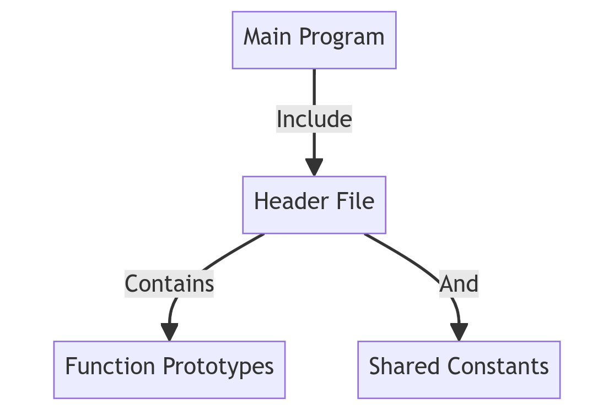
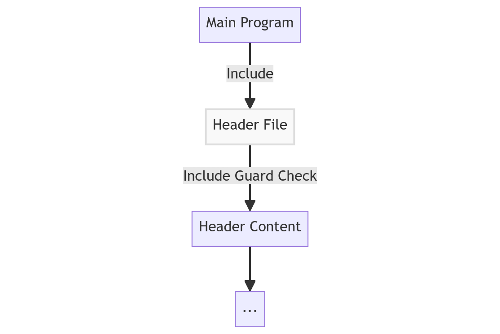

<!--
# Metadata
title: Header Files, Guards and Macros
author: Seb Blair (CompEng0001)
description: Lecture slides on Header Files, Guards and Macros.
keywords: module handbook
lang: en

# Slide styling
theme: uog-theme
_class: lead title
paginate: true
_paginate: false
transition: fade 250ms

style: |
  header em { font-style: normal; view-transition-name: header; }
  header strong { font-weight: inherit; view-transition-name: header2; }
  header:not:has(em) { view-transition-name: header; }
  header:not:has(strong) { view-transition-name: header; }
-->

<style scoped>
h1 {
  view-transition-name: header;
  display: flex;
  align-items: center;
  margin: 0 auto;
}
</style>

# Header Files

<div align=center style="font-size:76px; padding-left:300px;padding-right:300px;" >

```py
module = Module(
    code="ELEE1147",
    name="Programming for Engineers",
    credits=15,
    module_leader="Seb Blair BEng(H) PGCAP MIET MIHEEM FHEA"
)
```

</div>

<!-- _footer: "[Download as a PDF](https://github.com/UniOfGreenwich/ELEE1147_Lectures/raw/main/content/HeaderFilesGuardsMacros/HeaderFilesGuardsMacros.pdf)" -->

---

<style scoped>
h1 { view-transition-name: header2; }
</style>

<!-- header: "_Header Files_" -->
<!-- class: lead -->

# Why Use Header Files?

- **Modularity:** Separate interface from implementation.

- **Reusability:** Share functions and data structures.

- **Readability:** Enhance code organisation.

- **Function Prototypes:** Allows the compiler to check function signatures during compilation.

- **Precompiled Headers:** Speeds up compilation by avoiding redundant parsing of headers in multiple source files.

---

<style scoped>
h1 { view-transition-name: header2; }
</style>

<!-- class: lead -->
# How Does It Work?



<a name="howdoesitwork"></a>

---

<!-- header: "_Header Files_ > **How does it work?**" -->

<style scoped>
h1 { view-transition-name: header2; }

.columns-2 > div:nth-of-type(1) pre:nth-of-type(1) code {
  --highlight-line-begin: 2;
  --highlight-lines: 1;
  --highlight-line-color: rgb(255 255 255 / 15%);
}
.columns-2 > div:nth-of-type(2) pre:nth-of-type(1) code {
  --highlight-line-begin: 2;
  --highlight-lines: 2;
  --highlight-last-line: 19;
  --highlight-line-color: rgb(255 255 255 / 15%);
}
.columns-2 > div:nth-of-type(2) pre:nth-of-type(2) code {
  --highlight-line-begin: 2;
  --highlight-lines: 1;
  --highlight-line-color: rgb(255 255 255 / 15%);
}

</style>

<!-- _class: lead -->

<div class="columns-2">

<div align=center style="font-size:28px;padding-top:80px">

# Example

```c
// main.c
#include "header.h"

int main() {
    greeter();

    printf("PI: %.5f\n", PI);
    printf("Golden Ratio: %.5f\n", GR);

    struct Student s1 = {"Ada Lovelace", 42, 1.0f};
    printf("Student: %s, ID: %d, Grade: %.1f\n",
        s1.name, s1.studentId, s1.classification);

    return 0;
}
```

<span style="font-size:22px">Compile command for reference:</span>

```
gcc main.c header.c -o main.exe
```

</div> 

<div>

```h
// header.h
#ifndef HEADER_H // Header guard
#define HEADER_H // Macro

#include <stdio.h> // Other libraries

void greeter(); // Function prototype

#define PI 3.14159 // Shared constant
#define GR ((double)1.61803) // Golden Ratio

// Shared DataStorage
struct Student {
  char name[50];
  int studentId;
  float classification;
};

#endif // HEADER_H
```

```c
// header.c
#include "header.h"

void greeter(){
    printf("Hello World!")!
}
```

</div>

</div>

---


## What are Header Guards?

- **Purpose:** Prevent multiple inclusions of the same header file.
- **Issue:** Without guards, redefinitions can occur during multiple inclusions.
- **Solution:** Use preprocessor directives to conditionally include the contents.

---

## Why Use Header Guards?

<div class="columns-2">
<div style="padding-top:160px;padding-left:0px">

- **Avoid Redefinitions:** Prevent compilation errors due to duplicate declarations.

- **Ensure Once-Only Inclusion:** Each header is included only once in a translation unit.

- **Improve Compilation Efficiency:** Reduce redundant parsing of header contents.

</div>

<div style="padding-top:50px; padding-left:160px;padding-right:220px">


```h
#ifndef HEADER_H
#define HEADER_H

...

#endif //end of HEADER_H
```



</div>
</div>

---

<!-- header: "_Header Files_ > **How does it work?**" -->

<style scoped>
h1 { view-transition-name: header2; }

.columns-2 > div:nth-of-type(1) pre:nth-of-type(1) code {
  --highlight-line-begin: 7;
  --highlight-lines: 2;
  --highlight-last-line: 11;
  --highlight-line-color: rgb(255 255 255 / 15%);
}
.columns-2 > div:nth-of-type(2) pre:nth-of-type(1) code {
  --highlight-line-begin: 5;
  --highlight-lines: 1;
  --highlight-line-color: rgb(255 255 255 / 15%);
}
.columns-2 > div:nth-of-type(2) pre:nth-of-type(2) code {
  --highlight-line-begin: 2;
  --highlight-lines: 1;
  --highlight-last-line: 5;
  --highlight-line-color: rgb(255 255 255 / 15%);
}

</style>

<!-- _class: lead -->

<div class="columns-2">

<div align=center style="font-size:28px;padding-top:80px">

# Example

```c
// main.c
#include "header.h"

int main() {
    greeter();

    printf("PI: %.5f\n", PI);
    printf("Golden Ratio: %.5f\n", GR);

    struct Student s1 = {"Ada Lovelace", 42, 1.0f};
    printf("Student: %s, ID: %d, Grade: %.1f\n",
        s1.name, s1.studentId, s1.classification);

    return 0;
}
```

<span style="font-size:22px">Compile command for reference:</span>

```
gcc main.c header.c -o main.exe
```


</div> 

<div>

```h
// header.h
#ifndef HEADER_H // Header guard
#define HEADER_H // Macro

#include <stdio.h> // Other libraries

void greeter(); // Function prototype

#define PI 3.14159 // Shared constant
#define GR ((double)1.61803) // Golden Ratio

// Shared DataStorage
struct Student {
  char name[50];
  int studentId;
  float classification;
};

#endif // HEADER_H
```

```c
// header.c
#include "header.h"

void greeter(){
    printf("Hello World!")!
}
```

</div>

</div>

---

## Preprocessor Directive: `#include` `""` vs `<>` 

- Use `#include ""` 
  - for including header files that are part of your project or are in the current directory.

- Use `#include <>` for 
  - including standard library header files or other headers that are part of the system include directories.
---

## Standardised Header Examples</br>stdio.h:


```h
23. #ifndef _STDIO_H
24. #define _STDIO_H	1
25. 
26. #define __GLIBC_INTERNAL_STARTING_HEADER_IMPLEMENTATION
27. #include <bits/libc-header-start.h>
...
878. 
879. __END_DECLS
880. 
881. #endif /* <stdio.h> included.  */
```

<!-- _footer: https://code.woboq.org/userspace/glibc/libio/stdio.h.html -->

---

<!-- header: "_Header Files_ > **How does it work?**" -->

<style scoped>
h1 { view-transition-name: header2; }

.columns-2 > div:nth-of-type(1) pre:nth-of-type(1) code {
  --highlight-line-begin: 5;
  --highlight-lines: 1;
  --highlight-line-color: rgb(255 255 255 / 15%);
}
.columns-2 > div:nth-of-type(2) pre:nth-of-type(1) code {
  --highlight-line-begin: 7;
  --highlight-lines: 1;
  --highlight-line-color: rgb(255 255 255 / 15%);
}
.columns-2 > div:nth-of-type(2) pre:nth-of-type(2) code {
  --highlight-line-begin: 4;
  --highlight-lines: 1;
  --highlight-last-line: 6;
  --highlight-line-color: rgb(255 255 255 / 15%);
}

</style>

<!-- _class: lead -->

<div class="columns-2">

<div align=center style="font-size:28px;padding-top:80px">

# Example

```c
// main.c
#include "header.h"

int main() {
    greeter();

    printf("PI: %.5f\n", PI);
    printf("Golden Ratio: %.5f\n", GR);

    struct Student s1 = {"Ada Lovelace", 42, 1.0f};
    printf("Student: %s, ID: %d, Grade: %.1f\n",
        s1.name, s1.studentId, s1.classification);

    return 0;
}
```

<span style="font-size:22px">Compile command for reference:</span>

```
gcc main.c header.c -o main.exe
```

</div> 

<div>

```h
// header.h
#ifndef HEADER_H // Header guard
#define HEADER_H // Macro

#include <stdio.h> // Other libraries

void greeter(); // Function prototype

#define PI 3.14159 // Shared constant
#define GR ((double)1.61803) // Golden Ratio

// Shared DataStorage
struct Student {
  char name[50];
  int studentId;
  float classification;
};

#endif // HEADER_H
```

```c
// header.c
#include "header.h"

void greeter(){
    printf("Hello World!")!
}
```

</div>

</div>

---


<!-- header: "_Header Files_ > **How does it work?**" -->

<style scoped>
h1 { view-transition-name: header2; }

.columns-2 > div:nth-of-type(1) pre:nth-of-type(1) code {
  --highlight-line-begin: 7;
  --highlight-lines: 2;
  --highlight-line-color: rgb(255 255 255 / 15%);
}
.columns-2 > div:nth-of-type(2) pre:nth-of-type(1) code {
  --highlight-line-begin: 9;
  --highlight-lines: 2;
  --highlight-line-color: rgb(255 255 255 / 15%);
}
.columns-2 > div:nth-of-type(2) pre:nth-of-type(2) code {
  --highlight-line-begin: 2;
  --highlight-lines: 1;
  --highlight-line-color: rgb(255 255 255 / 15%);
}

</style>

<!-- _class: lead -->

<div class="columns-2">

<div align=center style="font-size:28px;padding-top:80px">

# Example

```c
// main.c
#include "header.h"

int main() {
    greeter();

    printf("PI: %.5f\n", PI);
    printf("Golden Ratio: %.5f\n", GR);

    struct Student s1 = {"Ada Lovelace", 42, 1.0f};
    printf("Student: %s, ID: %d, Grade: %.1f\n",
        s1.name, s1.studentId, s1.classification);

    return 0;
}
```

<span style="font-size:22px">Compile command for reference:</span>

```
gcc main.c header.c -o main.exe
```


</div> 

<div>

```h
// header.h
#ifndef HEADER_H // Header guard
#define HEADER_H // Macro

#include <stdio.h> // Other libraries

void greeter(); // Function prototype

#define PI 3.14159 // Shared constant
#define GR ((double)1.61803) // Golden Ratio

// Shared DataStorage
struct Student {
  char name[50];
  int studentId;
  float classification;
};

#endif // HEADER_H
```

```c
// header.c
#include "header.h"

void greeter(){
    printf("Hello World!")!
}
```

</div>

</div>

---


## Macros

Macros in C are a way to **define** constants or simple functions using the `#define` directive. They are preprocessor directives, meaning they are processed before the actual compilation of the code.

```h
// example_macros.h

#ifndef EXAMPLE_MACROS_H
#define EXAMPLE_MACROS_H

#define PI 3.14159 // Shared Constant
#define SQUARE(x) ((x) * (x)) // Function

#ifdef _MSC_VER
// Code specific to Microsoft Version C/C++
#endif //end of _MSC_VER

#endif // end of EXAMPLE_MACROS_H
```

---

## Standardised Header Examples:<br>[math.h]
```h
...
130. #define	M_E		((double)2.7182818284590452354)  /* e */
131. #define	M_LOG2E		((double)1.4426950408889634074)  /* log 2e */
132. #define	M_LOG10E	((double)0.43429448190325182765) /* log 10e */
133. #define	M_LN2		((double)0.69314718055994530942) /* log e2 */
134. #define	M_LN10		((double)2.30258509299404568402) /* log e10 */
135. #define	M_PI		((double)3.14159265358979323846) /* pi */
...
494. int __signbitl(long double);
495. __END_DECLS
496. 
497. #endif /* !_MATH_H_ */
```

<!-- _footer: https://github.com/openbsd/src/blob/master/include/math.h -->

---

<!-- header: "_Header Files_ > **How does it work?**" -->

<style scoped>
h1 { view-transition-name: header2; }

.columns-2 > div:nth-of-type(1) pre:nth-of-type(1) code {
  --highlight-line-begin: 10;
  --highlight-lines: 1;
  --highlight-last-line: 12;
  --highlight-line-color: rgb(255 255 255 / 15%);
}
.columns-2 > div:nth-of-type(2) pre:nth-of-type(1) code {
  --highlight-line-begin: 13;
  --highlight-lines: 5;
  --highlight-line-color: rgb(255 255 255 / 15%);
}
.columns-2 > div:nth-of-type(2) pre:nth-of-type(2) code {
  --highlight-line-begin: 2;
  --highlight-lines: 1;
  --highlight-line-color: rgb(255 255 255 / 15%);
}

</style>

<!-- _class: lead -->

<div class="columns-2">

<div align=center style="font-size:28px;padding-top:80px">

# Example

```c
// main.c
#include "header.h"

int main() {
    greeter();

    printf("PI: %.5f\n", PI);
    printf("Golden Ratio: %.5f\n", GR);

    struct Student s1 = {"Ada Lovelace", 42, 1.0f};
    printf("Student: %s, ID: %d, Grade: %.1f\n",
        s1.name, s1.studentId, s1.classification);

    return 0;
}
```

<span style="font-size:22px">Compile command for reference:</span>

```
gcc main.c header.c -o main.exe
```

</div> 

<div>

```h
// header.h
#ifndef HEADER_H // Header guard
#define HEADER_H // Macro

#include <stdio.h> // Other libraries

void greeter(); // Function prototype

#define PI 3.14159 // Shared constant
#define GR ((double)1.61803) // Golden Ratio

// Shared DataStorage
struct Student {
  char name[50];
  int studentId;
  float classification;
};

#endif // HEADER_H
```

```c
// header.c
#include "header.h"

void greeter(){
    printf("Hello World!")!
}
```

</div>

</div>


---

