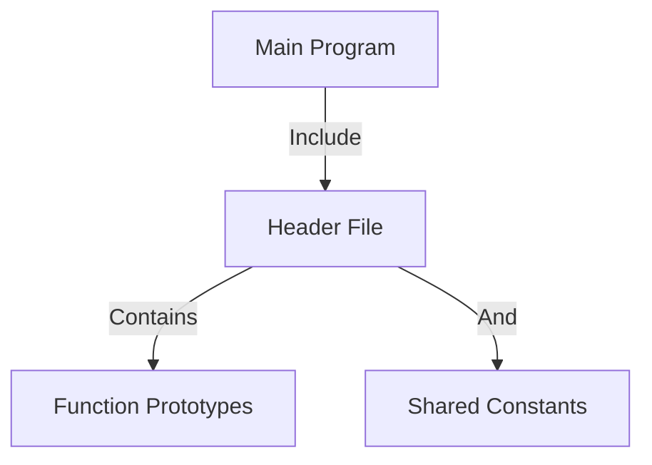

# Header Files, Guards and Macros

    Module Code: ELEE1147
    
    Module Name: Programming for Engineers

    Credits: 15

    Module Leader: Seb Blair BEng(H) PGCAP MIET MIHEEM FHEA

---


## Why Use Header Files?

- **Modularity:** Separate interface from implementation.
- **Reusability:** Share functions and data structures.
- **Readability:** Enhance code organisation.

---

## How Does It Work?


---


```c
// main.c
#include "header.h"

int main() {
    greet();
    return 0;
}
```


```h
// header.h
#ifndef HEADER_H
#define HEADER_H

// Function prototype
void greet();

// Shared constant
#define PI 3.14159

#endif // HEADER_H
```
---


## Function Prototypes

- **Purpose:** Declare function prototypes for functions in other source files.
- **Benefits:**
  - Allows the compiler to check function signatures during compilation. 
  - Enables type-checking and error-catching early in the compilation process.

<!-- signature: return type, name and parameters -->

---

## Shared Constants and Variables

- **Content:** Declarations of constants, global variables, or shared data structures.
- **Usage:**
  - Ensures consistency by including the header file in different program parts.
  - Facilitates the use of shared values and data structures across files.

---

## Code Reusability

- **Promotes:** Code reusability across multiple source files.
- **Advantages:**
  - Utilize common functions and data structures without duplicating code.
  - Especially beneficial for managing libraries of reusable functions.

---

## Modularity and Readability

- **Achieves:** Enhanced code modularity and readability.
- **Structure:**
  - Each source file focuses on its implementation.
  - Header file serves as an interface for interactions in the program.

---

## Separation of Interface and Implementation

-  **Modularity**: Header files define the module interface.
- **Implementation:** Actual implementation resides in separate source files `.c`.
- **Advantages:**
  - Follows the principle of information hiding.
  - Facilitates changes to implementations without affecting the entire program.

---

## Precompiled Headers

- **Compiler Support:** Some compilers offer precompiled headers.
- **Purpose:**
  - Preprocess frequently used headers and store in binary format.
  - Speeds up compilation by avoiding redundant parsing of headers in multiple source files.

---

## Examples:

[stdio.h](https://github.com/lattera/glibc/blob/master/libio/stdio.h)

```h
23. #ifndef _STDIO_H
24. #define _STDIO_H	1
25. 
26. #define __GLIBC_INTERNAL_STARTING_HEADER_IMPLEMENTATION
27. #include <bits/libc-header-start.h>
...
878. 
879. __END_DECLS
880. 
881. #endif /* <stdio.h> included.  */
```
---

## Examples:

[math.h](https://github.com/openbsd/src/blob/master/include/math.h)
```h
...
130. #define	M_E		((double)2.7182818284590452354)  /* e */
131. #define	M_LOG2E		((double)1.4426950408889634074)  /* log 2e */
132. #define	M_LOG10E	((double)0.43429448190325182765) /* log 10e */
133. #define	M_LN2		((double)0.69314718055994530942) /* log e2 */
134. #define	M_LN10		((double)2.30258509299404568402) /* log e10 */
135. #define	M_PI		((double)3.14159265358979323846) /* pi */
...
494. int __signbitl(long double);
495. __END_DECLS
496. 
497. #endif /* !_MATH_H_ */
```
---

