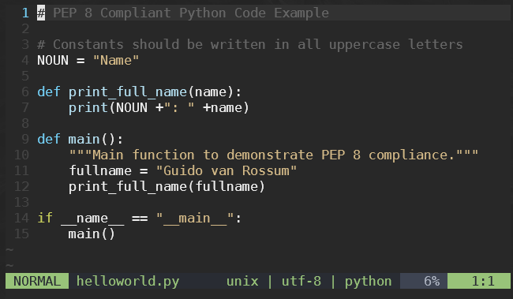

<!-- _footer: "[Download as a PDF](https://github.com/UniOfGreenwich/ELEE1147-Lectures/raw/gh-pages/content/IntroToPython/IntroToPython.pdf)" -->

# Introudction To Python

    Module Code: ELEE1147

    Module Name: Programming for Engineers

    Credits: 15

    Module Leader: Seb Blair BEng(H) PGCAP MIET MIHEEM FHEA

---

## Overview

- **Python** is a high-level, interpreted programming language.
- Created by **Guido van Rossum** and first released in **1991**.
- Python's design philosophy emphasizes:
  - **Code readability**
  - Use of significant whitespace.


---

## Why Python?

- **Simple and readable** syntax.
- Large **standard library**.
- **Cross-platform**: Works on Windows, Mac, Linux, and others.
- Popular in:
  - **Web development**
  - **Data science**
  - **Automation**
  - **Machine Learning**

---

## Python Enhancement Proposals (PEP)

- **PEP 8** is the style guide for Python code.
- It emphasizes:
  - Code readability
  - Consistent indentation
  - Use of spaces around operators and after commas.



---

## Versions of Python

- **Python 2** (Released in 2000)
  - Legacy, not supported after 2020.
  - Incompatible with Python 3.
  
- **Python 3** (Released in 2008)
  - Current and actively supported.
  - Many improvements over Python 2.


---

## Package Manager: `pip`

- **pip** stands for "Pip Installs Packages".
- Used to install, update, and remove Python packages.


  
### Common `pip` commands:
  
- Install a package: `pip install package_name`
- Upgrade a package: `pip install --upgrade package_name`
- List installed packages: `pip list`

---

## Variables and Data Types

- **Variables**: Store data values. No need to declare data types.
  
  ```python
  x = 5
  name = "Alice"
  ```

- **Basic Data Types** (implicit):
  - `int`: Integer numbers (e.g., 5)
  - `float`: Decimal numbers (e.g., 5.0)
  - `str`: String (e.g., "Hello")
  - `bool`: Boolean (True/False)

---

## Indentation and Syntax

- **Python** uses **indentation** to define the structure of code (instead of brackets).
- Consistent indentation is crucial for Python programs.

  ```python
  if x > 0:
      print("Positive")
  else:
      print("Non-positive")
  ```

- **Syntax** in Python is designed to be clean and readable. 
  - No need for semicolons to terminate statements.
  - Code blocks are identified by indentation levels, not braces.

---

## Functions

- Functions are defined using the `def` keyword.

  ```python
  def greet(name):
      return "Hello " + name

  def main():
      greet("Guido van Rossum")
  ```

---

## The `main()` Function

- In Python, scripts can have a `main()` function.
- You can use the following idiom to execute code only when the script is run directly (and not imported as a module):

  ```python
  import pandas as py # module installed via pip and ready to use here

  def main():
      print("This is the main function.")

  if __name__ == "__main__":
      main()
  ```

---

## Conditionals and Loops

<div style="font-size:26px">

- **Conditionals**: `if`, `elif`, `else`
  
  ```python
  if x > 0:
      print("Positive")
  elif x == 0:
      print("Zero")
  else:
      print("Negative")
  ```

- **Loops**: `for` and `while`

  ```python
  for i in range(5):
      print(i)
  
  x = 10
  
  while x > 0:
      x -= 1
  ```

</div>

---

## Conclusion

- Python is an accessible and versatile programming language.
- Its applications span from web development to data science.
- Python's package manager, `pip`, makes it easy to manage packages.
- Understanding basics like variables, data types, functions, conditionals, PEP standards, and indentation gives a strong foundation.

---

## References

- Python Official Website: [python.org](https://www.python.org/)
- Python Package Index: [pypi.org](https://pypi.org/)
- PEP 8: [pep8.org](https://pep8.org/)