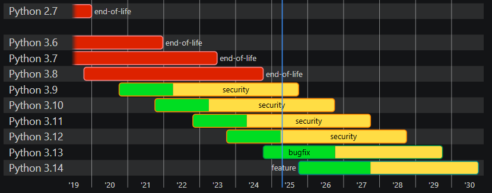
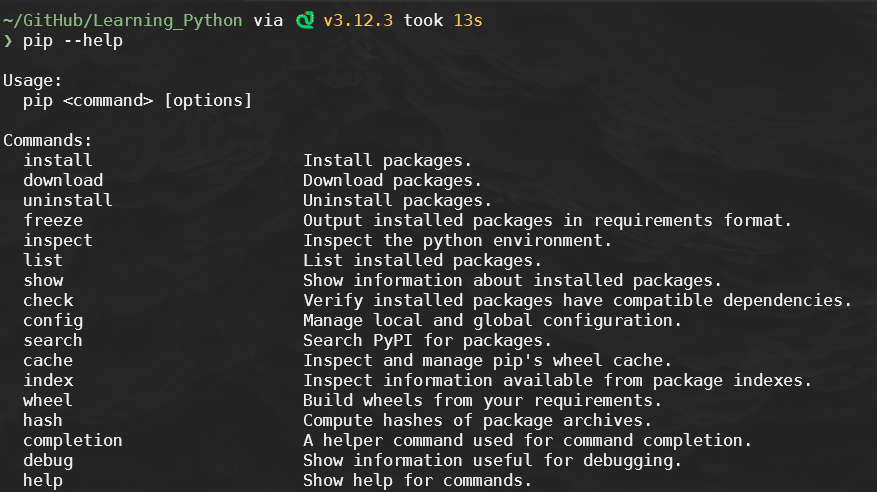

<!--
# Metadata
title: Introudction To Python
author: Seb Blair (CompEng0001)
description: Lecture slides on Introudction To Python.
keywords: module handbook
lang: en

# Slide styling
theme: uog-theme
_class: lead title
paginate: true
_paginate: false
transition: fade 250ms

style: |
  header em { font-style: normal; view-transition-name: header; }
  header strong { font-weight: inherit; view-transition-name: header2; }
  header:not:has(em) { view-transition-name: header; }
  header:not:has(strong) { view-transition-name: header; }
-->

<style scoped>
h1 {
  view-transition-name: header;
  display: flex;
  align-items: center;
  margin: 0 auto;
}
</style>

# Introudction To Python

<div align=center style="font-size:76px; padding-left:300px;padding-right:300px;" >

```py
module = Module(
    code="ELEE1147",
    name="Programming for Engineers",
    credits=15,
    module_leader="Seb Blair BEng(H) PGCAP MIET MIHEEM FHEA"
)
```

</div>


<!-- _footer: "[Download as a PDF](https://github.com/UniOfGreenwich/ELEE1147_Lectures/raw/main/content/IntroToPython/IntroToPython.pdf)" -->

---

<style scoped>
h1 { view-transition-name: header2; }
</style>

<!-- header: "_Introudction To Python_" -->

<div style="padding-top:50px; padding-bottom:100px">

## Overview

</div>


- **Python** is a high-level, interpreted programming language.
<br>
- Created by **Guido van Rossum** and first released in **1991**.
<br>
- Python's design philosophy emphasizes:
  <br>
  - **Code readability**
  <br>
  - Use of significant whitespace.


---

<div>

## Why Python?

</div>


- **Simple and readable** syntax.
<br>
- Large **standard library**.
<br>
- **Cross-platform**: Works on Windows, Mac, Linux, and others.
<br>
- Popular in:
  - **Web development**
  <br>
  - **Data science**
  <br>
  - **Automation**
  <br>
  - **Machine Learning**


---

## Versions of Python

<div class="columns-2" style="padding-top:50px">
<div>

- **Python 2** (Released in 2000)
  - Legacy, not supported after 2020.
  - Incompatible with Python 3.

<br>

- **Python 3** (Released in 2008)
  - Current and actively supported.
  - Many improvements over Python 2.

<br>

- **Python 4** (Release -- no time soon)
  - Massive overhaul, breaking change
  - python 2 to 3 was a huge task.


</div>
<div style="padding-top:150px">



</div>
</div>

<!-- _footer: https://devguide.python.org/versions/ -->

---

<style scoped>
h1 { view-transition-name: header2; }
</style>

<!-- class: lead -->

# Python Enhancement Proposals (PEP)

<!-- _footer: https://peps.python.org/pep-0000/# -->

---

<!-- header: "_Introudction To Python_ > **PEP**" -->

<div class="columns-2" style="padding-top:100px">
<div>

**PEP** is the style guide for Python code.

<br>

- all files have a top level docstring

</div>

<div>

```py
""" 
PEP Compliant Python Code Example
"""

NOUN="Name"

def print_full_name(name):
    """
    Function takes one argument...
    ...
    args name
    """
    print(NOUN + ": " + name)

def main():
    """main function to demonstrate PEP compliances"""
    fullname = "Guido van Rossum"
    print_full_name(name)

if __name__ == "__main__":
    main()
```

</div>
</div>


<style scoped>
code {
  --highlight-line-begin: 1;
  --highlight-lines: 3;
  --highlight-line-color: rgb(255 255 255 / 15%);
}
</style>

---


<div class="columns-2" style="padding-top:100px">
<div>

**PEP** is the style guide for Python code:

<br>

- all functions should have docstrings
<br>
- can be single or multiline  
<br>
- if you have arguments or returns then they have be to be documented 

</div>

<div>

```py
""" 
PEP Compliant Python Code Example
"""

NOUN="Name"

def print_full_name(name):
    """
    Function takes one argument...
    ...
    args name
    """
    print(NOUN + ": " + name)

def main():
    """main function to demonstrate PEP compliances"""
    fullname = "Guido van Rossum"
    print_full_name(name)

if __name__ == "__main__":
    main()
```

</div>
</div>


<style scoped>
code {
  --highlight-line-begin: 8;
  --highlight-lines: 5;
  --highlight-last-line: 16;
  --highlight-line-color: rgb(255 255 255 / 15%);
}
</style>

---

<div class="columns-2" style="padding-top:100px">
<div>

**PEP** is the style guide for Python code:

<br>

- naming conventions for functions are lower snake case

</div>

<div>

```py
""" 
PEP Compliant Python Code Example
"""

NOUN="Name"

def print_full_name(name):
    """
    Function takes one argument...
    ...
    args name
    """
    print(NOUN + ": " + name)

def main():
    """main function to demonstrate PEP compliances"""
    fullname = "Guido van Rossum"
    print_full_name(name)

if __name__ == "__main__":
    main()
```

</div>
</div>


<style scoped>
code {
  --highlight-line-begin: 7;
  --highlight-lines: 1;
  --highlight-last-line:15;
  --highlight-line-color: rgb(255 255 255 / 15%);
}
</style>

---

<div class="columns-2" style="padding-top:100px">
<div>

**PEP** is the style guide for Python code:

<br>

-  constant variables are uppercase / upper snake case

<br>

- local variables are lowercase
</div>

<div>

```py
""" 
PEP Compliant Python Code Example
"""

NOUN="Name"

def print_full_name(name):
    """
    Function takes one argument...
    ...
    args name
    """
    print(NOUN + ": " + name)

def main():
    """main function to demonstrate PEP compliances"""
    fullname = "Guido van Rossum"
    print_full_name(name)

if __name__ == "__main__":
    main()
```

</div>
</div>


<style scoped>
code {
  --highlight-line-begin: 5;
  --highlight-lines: 1;
  --highlight-last-line:17;
  --highlight-line-color: rgb(255 255 255 / 15%);
}
</style>

---

<!-- header: "Introduction To Python" -->

## Package Manager: `pip`

- **pip** stands for "Pip Installs Packages".
- Used to install, update, and remove Python packages.


  
### Common `pip` commands:
  
- Install a package: `pip install package_name`
- Upgrade a package: `pip install --upgrade package_name`
- List installed packages: `pip list`

---


<!-- class: lead -->

# Writing Code


<style scoped>
h1 { view-transition-name: header2; }
</style>


---

<!-- header: "_Introduction To Python_ > **Writing Code**" -->

<div>

## Variables and Data Types

</div>

<div class="columns-2">
<div style="padding-top:100px">

- **Variables**: 
  - Store data values. 
  - implicit byt default
  - explicit if you want it to be

<br>

- **Basic Data Types** (implicit):
  - `int`: Integer numbers (e.g., 5)
  - `float`: Decimal numbers (e.g., 5.0)
  - `str`: String (e.g., "Hello")
  - `bool`: Boolean (True/False)

</div>
<div style="padding-top:200px">

```python
count = 5
factor = 1.16803
name = "Guido van Rossum"
is_active = True
is_inverse_state = False

---

count: int = 5
factor: float = 1.16803
name: str = "Guido van Rossum"
is_active: bool = True
is_inverse_state: bool = False
```

</div>
</div>

---

<div>

## Indentation and Syntax

</div>
<div class="columns-2" style="padding-top:50px">
<div>

- **Python** uses **indentation** to define the structure of code (instead of brackets).
  - Consistent indentation is crucial for Python programs.

<br>

- **Syntax** in Python is designed to be clean and readable. 
  - No need for semicolons to terminate statements.
  - Code blocks are identified by indentation levels, not braces.

</div>
<div>

```py
# Function definition with proper indentation
def greet(name: str) -> None:
    if name:
        print(f"Hello, {name}!")
    else:
        print("Hello, World!")

# Calling the function
greet("Guido van Rossum")
greet("")

# Loop with indentation
for i in range(5):
    print(i)

# Conditional statement with indentation
x = 10
if x > 5:
    print("x is greater than 5")
else:
    print("x is 5 or less")
```

</div>
</div>

---

<div style="padding-top:100px">

## Functions

</div>

<div class="columns-2">
<div style="padding-top:200px">

- Functions are defined using the `def` keyword.
- can take arguments
  - implicit and explict data types
  - return values
- docstrings should be implemented
</div>
<div>

```python
def add(a, b):
    """
    Adds two numbers together.

    Parameters:
    a (int or float): The first number.
    b (int or float): The second number.

    Returns:
    int or float: The sum of the two numbers.
    """
    return a + b

def add_safe(a: int, b: int) -> int:
    """
    Adds two numbers together with explicit data types.

    Parameters:
    a (int): The first number.
    b (int): The second number.

    Returns:
    int: The sum of the two numbers.
    """
    return a + b
```
  
</div>
</div>

---

<div>

## The `main()` Function

</div>

<div class="columns-2">
<div>

- In Python, scripts can have a `main()` function.

<br>

</div>
<div>

```python
import sys  # Module for system-specific parameters and functions

def main():
    """
    This is the main function.
    """
    print("This is the main function.")
    sys.exit(0)

if __name__ == "__main__":
    main()
```

</div>
</div>


<style scoped>
code {
  --highlight-line-begin: 3;
  --highlight-lines: 1;
  --highlight-last-line:17;
  --highlight-line-color: rgb(255 255 255 / 15%);
}
</style>

---

<div>

## The `main()` Function

</div>

<div class="columns-2">
<div style="padding-top:50px">

- In Python, scripts can have a `main()` function.

<br>

- Ensures that the main() function is executed only when the script is run directly, not when imported as a module.
  - You can use the following idiom to execute code only when the script is run directly (and not imported as a module)

<br>

</div>
<div style="padding-top:200px">

```python
import sys  # Module for system-specific parameters and functions

def main():
    """
    This is the main function.
    """
    print("This is the main function.")
    sys.exit(0)

if __name__ == "__main__":
    main()
```

</div>
</div>

<style scoped>
code {
  --highlight-line-begin: 10;
  --highlight-lines: 1;
  --highlight-last-line:17;
  --highlight-line-color: rgb(255 255 255 / 15%);
}
</style>

---

## Conditionals and Loops

<div class="columns-2" style="font-size:26px">
<div style="padding-top:150px; padding-left:200px">

- **Conditionals**: `if`, `elif`, `else`

<br>
<br>
<br>

- **Loops**: `for` and `while`

</div>
<div style="padding-top:100px; padding-right:250px">

```python
  if x > 0:
      print("Positive")
  elif x == 0:
      print("Zero")
  else:
      print("Negative")
  ```


  ```python
  for i in range(5):
      print(i)
  
  x = 10
  
  while x > 0:
      x -= 1
  ```

</div>
</div>

---

## Conclusion

- Python is an accessible and versatile programming language.
- Its applications span from web development to data science.
- Python's package manager, `pip`, makes it easy to manage packages.
- Understanding basics like variables, data types, functions, conditionals, PEP standards, and indentation gives a strong foundation.