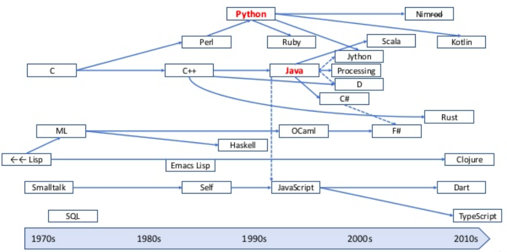
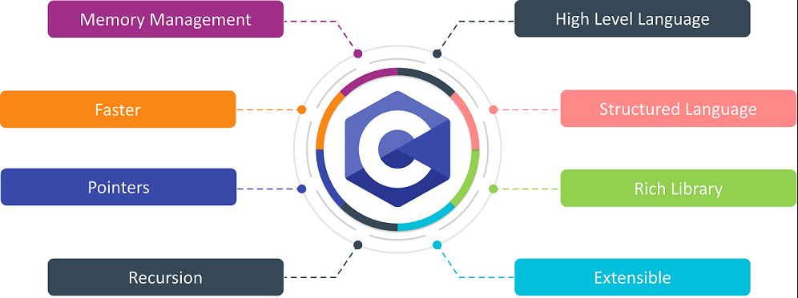
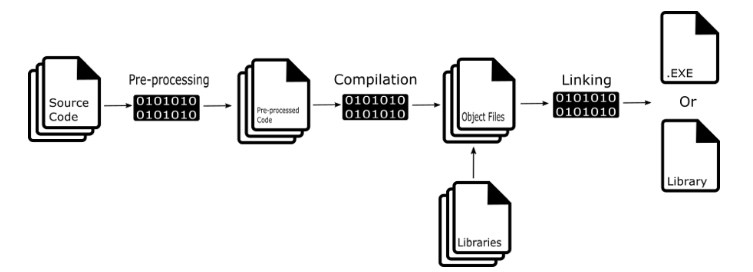
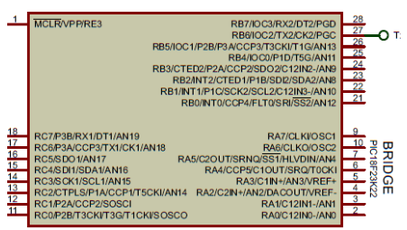
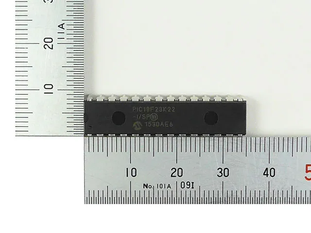
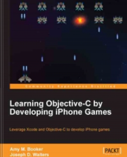

<!-- _footer: "[Download as a PDF](https://github.com/UniOfGreenwich/ELEE1147_Lectures/raw/gh-pages/content/Intro_To_C/Intro_To_C.pdf)" -->

# Introduction to C

    Course Code: ELEE1147
    
    Course Name: Programming for Engineers

    Credits: 15

    Module Leader: Seb Blair BEng(H) PGCAP MIET MIHEEM FHEA
    
---

## C is god's programming language 



---
## Why C?
> Developed by Denis Ritchie (Steve Jobs eat your heart out)
>>

- general-purpose (oringially designed for UNIX) 
- provides common ancestry
- structured programming language
- machine-independent
- low level

---



---

## First Program in C
This is the first program we are going to create in C. It is a tribute to Denis Ritchie program written in C.
```c
// library or header file that contains  standard input/output operatioins

#include <stdio.h>

/* 
  main() function every C program must have a main, 
  it has a returnable 'int' this is for exit codes
*/
int main(void) // void means no input argument
{
    printf("Hello World!\n");
    printf("Goodbye World!\n");
    return 0; // return exit code 0, no error
}
```
---

## Compile the code

We are going to use `gcc` compiler to compile our `c` code; first argument is the source file[s], and `-o` means output file. The file extension in linux can be left blank or called whatever you want. 

```sh
$ gcc helloworld.c -o helloworld.[out,exe,...]
```
<!---->


---
## Execute the code

As we are using a terminal, we must prepend the newley created file with `./`. The `.` denotes the current directory. Since we want to run a file in our current directory and that directory is not in our `$PATH`, you need the `./` bit to tell the shell where the executable is.

**Output:**
```sh
$ ./helloworld.exe
Hello World!
Goodbye World!
```
---

## Header Files
> Libraries

These files contain all scaffolding code that your `main()` will use as we do not want to overpopulate with excessive lines of code for readability.

Computers used to be too slow to compile a whole program in one single mega-blob where all the functions and types were visible.

To solve this, programs are split into c/h files which are each individually compiled into a machine code file (the ‘object’ file), and then linked together into an exe or dll.

---

## Header Files Continued

<div style="font-size:25px">

**usefulfunctions.h**
```c
#ifndef USEFULFUNCTIONS_H_   /* Include guard */
#define USEFULFUNCTIONS_H_

int sqr(int x);  /* An example function declaration */

#endif // USEFULFUNCTIONS_H_

``` 

**usefulfunctions.c**
```c
#include "usefulfunctions.h"  /* Include the header (not strictly necessary here) */

int sqr(int x)    /* Function definition */
{
    return x * x;
}
```

</div>

---
## Revist helloworld.c

We are modifiying the code to use our custom library:

```c 
#include <stdio.h> /* searches system header file directories */
#include "usefulfunctions.h" /* notice "" searches current directory */

int main(void) /* void means no input argument */
{
    printf("Hello World\n!");  /* using standard ouput function to printf()*/
    printf("%d\n",sqr(255));
    printf("Goodbye World!\n");

    return 0; /* return exit code 0, no error */
}

```
---

## Compile and run

We need to source all files needed to build our modified program. 

Remember the header file points to the function in the `usefulfunctions.c` file.

```sh
$ gcc helloworld.c usefulfunctions.c -o helloworld.out

```

**Output:**

```sh
$ ./helloworld.out
Hello World!
65025
Goodbye World!
```

---

## Standard Input and Output 

 - `stdio.h` is a large file that contains many function declarations, in fact there are 827 lines of code for this header file alone.

    - [stdio.h source code](https://code.woboq.org/userspace/glibc/libio/stdio.h.html)

>  You should feel a sense of accomplishment for the code you have written so far... just remember that someone wrote the code for your code to work .

---

<div style="font-size:20px">

## Primitive Data Types


C has several data types and all variables **must** have a data type

|Data Type	|Size (Bytes)|	Range | Format Specifier |
|---|---|---|---|
|(unsigned)char	| at least 1 	| $-128$ to $127$ or $0$ to $255$ | `%c`
|(unsigned)short| at least 2 |	$-32768$ to $32767$, $0$ to $65535$| `%h`
|(unsigned)int |	at least 2 |	$-2,147,483,648$ to  $2,147,483,647$   $0$ to $4294967295$| `%u`,`%d`|
|long	| least 4 | $–9,223,372,036,854,775,808$ to $9,223,372,036,854,775,807$| `%l`, `%ll`, `%lld`, `%lli` |
|unsigned long |	at least 4  |	$0$ to $18,446,744,073,709,551,615$| `%lu`,`%llu`|
|float | at least 2 |	$3.4e-038$ to $3.4e+038$|`%f`|
|(unsigned)double	| at least 8 |	$1.7e-308$ to $1.7e+308$| `%lf`|
|long double |	  at least 10 |   $1.7e-4932$ to $1.7e+4932$| `%Lf`|

</div>

---

## C Advanced Features

- Pointers and addressing, `int*`, `&var1` (more about this later)
- `struct`
  - Allows to combine data items of different kinds
  - `struct Books { char  title[50]; char author[50]; int book_id;} book`
- `enum`
  - It consists of constant integrals or integers that are given names by a user.
  - `enum enum_name{int_const1, int_const2, int_const3, …. int_constN};`
- `union` 
  - allows to store different data types in the same memory location
  - `union Data { int i; float f; char str[20];} data;` 

---
## Embedded C




```c
ANSEL  = 0;      // Configure AN pins as digital I/O
ANSELH = 0;
C1ON_bit = 0;    // Disable comparators
C2ON_bit = 0;
//         76543210
TRISC  = 0b10000000;   // PORTC is input
UART1_Init(9600); // Initialize UART PROTO

...

ANSELA  = 0;      // Configure AN pins as digital I/O
ANSELB  = 0;
ANSELC  = 0;
TRISB = 0;
```

---
## Objective-C


```objc
#import "MyClass.h"
 
@implementation MyClass
- (id)initWithString:(NSString *)aName
{
    // code goes here
}
 
+ (MyClass *)myClassWithString:(NSString *)aName
{
    // code goes here
}
@end
```
---

## Compilation

<div style="font-size:24px">

Throughout this lab we have been using `gcc` or `the GNU Compiler Collection'. The GNU is a recursive acronym: ‘GNU’s Not Unix!'

Supports:

-  C, 
-  embedded-C ,
-  Objective-C,
-  C++,
-  Fortran, 
-  Ada, 
-  Go, 
-  and D 

</div>

---

## Command Line Arguments

<div style="font-size:24px">

```c
#include <stdio.h>

int main( int argc, char *argv[] )  {

   printf("Program name %s\n", argv[0]);
 
   if( argc == 2 ) {
      printf("The argument supplied is %s\n", argv[1]);
   }
   else if( argc > 2 ) {
      printf("Too many arguments supplied.\n");
   }
   else {
      printf("One argument expected.\n");
   }
   return 0;
}
```

</div>

Let's do this now...