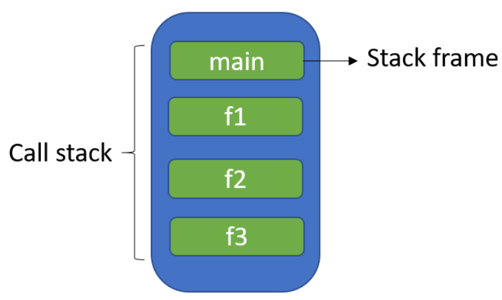

<!--
# Metadata
title: Pointers And Addressing
author: Seb Blair (CompEng0001)
description: Lecture slides on Pointers And Addressing.
keywords: module handbook
lang: en

# Slide styling
theme: uog-theme
_class: lead title
paginate: true
_paginate: false
transition: fade 250ms

style: |
  header em { font-style: normal; view-transition-name: header; }
  header strong { font-weight: inherit; view-transition-name: header2; }
  header:not:has(em) { view-transition-name: header; }
  header:not:has(strong) { view-transition-name: header; }
-->

<style scoped>
h1 {
  view-transition-name: header;
  display: flex;
  align-items: center;
  margin: 0 auto;
}
</style>

# Pointers And Addressing

<div align=center style="font-size:76px; padding-left:300px;padding-right:300px;" >

```py
module = Module(
    code="ELEE1147",
    name="Programming for Engineers",
    credits=15,
    module_leader="Seb Blair BEng(H) PGCAP MIET MIHEEM FHEA"
)
```

</div>

<!-- _footer: "[Download as a PDF](https://github.com/UniOfGreenwich/ELEE1147_Lectures/raw/main/content/PointersAndAddressing/PointersAndAddressing.pdf)" -->

---

<style scoped>
h1 { view-transition-name: header2; }
</style>

<!-- header: "_Pointers And Addressing_" -->
<!-- class: lead -->

 
# Principle of Locality 

<div>

Programs tend to use data and instructions with addresses near or equal to those they have used recently​

</div>

---

<!-- header: "_Pointers And Addressing_ > **Principle of Locality**" -->

<div style="padding-top:10px">

**Temporal**

- Recently referenced items are likely to be referenced again in the near future​


</div>

<div style="padding-top:360px">

**Spatial**

- Items with nearby addresses tend to be referenced close together in time​


</div>


---

<!-- header: "Pointers And Addressing" -->

# Example

<div class="columns-2">

<div>

- **Spatial**
  - Access array elements `a[i]` in succession – Data
  - Reference instructions in sequence – Instruction

- **Temporal**
  - Reference `sum` each iteration – Data ​
  - Cycle through loop repeatedly -  Instruction
  
</div>

<div style="padding-top:80px">

```c
int main(){

  int sum = 0;​
  int a[5];
  
  for ( int i = 0; i < n; i++ )​
  {​
    sum += a[i];​
  }

  return 0;
}
```

</div>
</div>


---

<style scoped>
h1 { view-transition-name: header2; }
</style>

<!-- header: "Pointers And Addressing" -->


# Stack, Static and Heap 

<div>

The great thing about C is that it is so intertwined with memory – and by that I mean that the programmer has quite a good understanding of “what goes where“. C has three different pools of memory.

</div>

<div class="columns-2" style="padding-top:50px">
<div style="padding-top:20px">

- **static**: global variable storage, permanent for the entire run of the program.
<br>
- **stack**: local variable storage (automatic, continuous memory).
<br>
- **heap**: dynamic storage (large pool of memory, not allocated in contiguous order).

</div>

<div>


</div>

</div>

---

<!-- header: "_Pointers And Addressing_ > **Stack, Static and Heap**" -->

## General Memory Layout


- [1] **text**: stores the code being executed

- [2] **data**: stores global variables, separated into initialised and uninitialised

- [3] **stack**: stores local variables

- [4] **heap**: dynamic memory for programmer to allocate

---

<div>

## Static

</div>

<div class="columns-2">

<div style="font-size:26px; padding-top:70px">

- Static memory persists throughout the entire life of the program, and is usually used to store things like global variables, or variables created with the static clause.

<br>

- On many systems this variable uses 4 bytes of memory. This memory can come from one of two places. If a variable is declared outside of a function, it is considered global, meaning it is accessible anywhere in the program. Global variables are static, 

</div>

<div>
<div style="font-size:21px">

```c
#include <stdio.h>

// Global variable
int globalVar = 10;

void demoFunction() {
    int localVar = 5;
    
    static int staticLocalVar = 5;
    
    // Incrementing static local variable
    localVar++;
    staticLocalVar++;
    
    // Printing values and memory addresses
    printf("Local Variable: %d, Address: %p\n", localVar, &localVar);
    printf("Global Variable: %d, Address: %p\n", globalVar, &globalVar); 
    printf("Static Local Variable: %d, Address: %p\n", staticLocalVar, &staticLocalVar);
}

int main() {
    demoFunction();
    return 0;
}
```

```
❯ ./global.exe
Global Variable: 10, Address:      00007FF6F3403000
Static Local Variable: 6, Address: 00007FF6F3403004
Local Variable: 6, Address:        000000CA637FF88C
```

</div>

</div>
</div>

<style scoped>
h1 { view-transition-name: header2; }

.columns-2 > div:nth-of-type(2) pre:nth-of-type(1) code {
  --highlight-line-begin: 4;
  --highlight-lines: 1;
  --highlight-last-line: 9;
  --highlight-line-color: rgb(255 255 255 / 15%);
}
.columns-2 > div:nth-of-type(2) pre:nth-of-type(2) code {
  --highlight-line-begin: 2;
  --highlight-lines: 2;
  --highlight-line-color: rgb(255 255 255 / 15%);
}
</style>

----

<div>

## Static

</div>

<div class="columns-2">

<div style="font-size:26px; padding-top:70px">

- Static memory persists throughout the entire life of the program, and is usually used to store things like global variables, or variables created with the static clause.

<br>

- On many systems this variable uses 4 bytes of memory. This memory can come from one of two places. If a variable is declared outside of a function, it is considered global, meaning it is accessible anywhere in the program. Global variables are static, 

</div>

<div>
<div style="font-size:21px">

```c
#include <stdio.h>

// Global variable
int globalVar = 10;

void demoFunction() {
    int localVar = 5;
    
    static int staticLocalVar = 5;
    
    // Incrementing static local variable
    localVar++;
    staticLocalVar++;
    
    // Printing values and memory addresses
    printf("Local Variable: %d, Address: %p\n", localVar, &localVar);
    printf("Global Variable: %d, Address: %p\n", globalVar, &globalVar); 
    printf("Static Local Variable: %d, Address: %p\n", staticLocalVar, &staticLocalVar);
}

int main() {
    demoFunction();
    return 0;
}
```

```
❯ ./global.exe
Global Variable: 10, Address:      00007FF6F3403000
Static Local Variable: 6, Address: 00007FF6F3403004
Local Variable: 6, Address:        000000CA637FF88C
```

</div>

</div>
</div>

<style scoped>
h1 { view-transition-name: header2; }

.columns-2 > div:nth-of-type(2) pre:nth-of-type(1) code {
  --highlight-line-begin: 7;
  --highlight-lines: 1;
  --highlight-line-color: rgb(255 255 255 / 15%);
}
.columns-2 > div:nth-of-type(2) pre:nth-of-type(2) code {
  --highlight-line-begin: 4;
  --highlight-lines: 1;
  --highlight-line-color: rgb(255 255 255 / 15%);
}
</style>

----

## Stack



- The stack is managed by the CPU, there is no ability to modify it
<br>
- Variables are allocated and freed automatically
<br>
- The stack it not limitless – most have an upper bound
<br>
- The stack grows and shrinks as variables are created and destroyed
<br>
- Stack variables only exist whilst the function that created them exists

---

<div style="padding-bottom:50px">

## Stack

</div>

- It’s a `LIFO`, “Last-In,-First-Out”, structure. Every time a function declares a new variable it is “pushed” onto the stack. 
<br>
- The stack is managed by the CPU, there is `no ability` to modify it
<br>
- Variables are allocated and freed `automatically`
<br> 
- The stack it not limitless – most have an `upper bound`
<br>
- The stack `grows and shrinks` as variables are created and destroyed
<br>
- Stack variables only exist `whilst` the `function` that created them `exists`
---

## Stack Overflow

<div>

- A stack overflow occurs if the call stack pointer exceeds the stack bound. 

<br>

- The call stack may consist of a limited amount of address space, often determined at the start of the program.

</div>


---

<div>

## Heap

</div>

<div style="font-size:28px">

The heap is the diametrically `opposite of the stack`. 

</div>

<div class="columns-2" style="padding-top:50px">
<div style="font-size:28px">

- The heap is **managed** by the **programmer**, the ability to modify it is somewhat boundless
<br>
- The heap is large, and is usually **limited** by the **physical memory** available in an embedded environment and in a PC it is stored within paging files on main memory (SSD)
<br>
- This is memory that is not automatically managed 
  – you have to explicitly allocate (using functions such as `malloc()`,`calloc()`,`realloc()`), and deallocate (`free()`) the memory. 
<br>
- The heap **requires pointers** to access it

</div>
<div style="font-size:28px;padding-top:30px">

```c
#include <windows.h>
#include <stdio.h>
#include <malloc.h>

int main() {
    _HEAPINFO hinfo;
    int heapstatus;
    hinfo._pentry = NULL;

    size_t total_allocated = 0;

    while ((heapstatus = _heapwalk(&hinfo)) == _HEAPOK) {
        total_allocated += hinfo._size;
    }

    if (heapstatus == _HEAPEND) {
        printf("Total heap space allocated: %zu bytes\n", total_allocated);
    }

    return 0;
}
```

```
❯ ./heap.exe
Total heap space allocated: 84098 bytes
```

</div>
</div>

---

<div class="columns-2">

<div style="padding-top:200px;padding-left:200px;padding-right:100px;">

# Example

- `char *str;`

  This declares a pointer to a character.

  At this point, str points nowhere useful — it's uninitialised.

</div>
<div style="padding-top:80px">

```c
#include <stdio.h>
#include <stdlib.h>

int main(void) 
{
    int y = 4; char *str; 

    printf("stack memory: %d\n", y);

    str = malloc(100*sizeof(char)); 
    str[0] = 'm';
    for(int i =0; i< 100; i++)
    {    
        printf("heap memory: %c\n", str[i]); 
    }
    free(str); 
    printf("heap memory: %c\n", str[0]);
    return 0;
}
```

</div>
</div>

<style scoped>
h1 { view-transition-name: header2; }

.columns-2 > div:nth-of-type(2) pre:nth-of-type(1) code {
  --highlight-line-begin: 6;
  --highlight-lines: 1;
  
  --highlight-line-color: rgb(255 255 255 / 15%);
}
</style>

---

<div class="columns-2">

<div style="padding-top:200px;padding-left:200px;padding-right:100px;">

# Example

- `malloc(100 * sizeof(char))`

  malloc allocates heap memory dynamically.

- `sizeof(char)` is always `1`, so this is just `malloc(100)`.

  So we are allocating 100 bytes of memory on the heap for `str` to point to.

</div>
<div style="padding-top:145px">

```c
#include <stdio.h>
#include <stdlib.h>

int main(void) 
{
    int y = 4; char *str; 

    printf("stack memory: %d\n", y);

    str = malloc(100*sizeof(char)); 
    str[0] = 'm';
    for(int i =0; i< 100; i++)
    {    
        printf("heap memory: %c\n", str[i]); 
    }
    free(str); 
    printf("heap memory: %c\n", str[0]);
    return 0;
}
```

</div>
</div>

<style scoped>
h1 { view-transition-name: header2; }

.columns-2 > div:nth-of-type(2) pre:nth-of-type(1) code {
  --highlight-line-begin: 10;
  --highlight-lines: 1;

  --highlight-line-color: rgb(255 255 255 / 15%);
}
</style>

---


<div class="columns-2">

<div style="padding-top:200px;padding-left:200px;padding-right:100px;">

# Example

- `free()` 
   is a standard C library function used to deallocate heap memory that was previously allocated with

</div>
<div style="padding-top:80px">

```c
#include <stdio.h>
#include <stdlib.h>

int main(void) 
{
    int y = 4; char *str; 

    printf("stack memory: %d\n", y);

    str = malloc(100*sizeof(char)); 
    str[0] = 'm';
    for(int i =0; i< 100; i++)
    {    
        printf("heap memory: %c\n", str[i]); 
    }
    free(str); 
    printf("heap memory: %c\n", str[0]);
    return 0;
}
```

</div>
</div>

<style scoped>
h1 { view-transition-name: header2; }

.columns-2 > div:nth-of-type(2) pre:nth-of-type(1) code {
  --highlight-line-begin: 16;
  --highlight-lines: 1;

  --highlight-line-color: rgb(255 255 255 / 15%);
}
</style>

---

## Memory Allocation

<div>

- a `char`acter, 1 byte of memory which is:

  $$  8\ bit = 1 * 8$$

<br>

- an `int`eger or a `float`, 4 byte of memory which is:
  $$  32\ bit = 4 * 8$$

<br>

- a `double` value, 8 byte of memory which is :

  $$64\ bit = 8 * 8$$

<br>

</div>


---

## Memory Allocation: Pointers and Addresssing

- In C/C++/C# you can access a variables address using the `&` and `*` symbol.​
<br>
- With ‘address of’ `&` we can reference the variable’s address when used with itself. ​
<br>
- A ‘pointer’ `*` is a variable that stores the address of another variable. ​
<br>
- Be warned, playing with unprotected memory is dangerous and can cause systems to crash and even become unrecoverable.​

---

<div class="columns-2">
<div style="padding-top:100px">

## Memory Allocation: C

</div>
<div>

```c
int main ()​
{ // The variable has its own address (unknown to us now)​
  int n = 11; ​
  // this variable stores the address of the other variable​
  int *ptrToN = n; ​
  printf(“n’s address: %d and %d ptrToN value \n”, &n, ptrToN); ​
  printf(“n’s value: %d and ptrToN points to value %d \n”, n, *ptrToN); ​
  return 0;​
}
```


```
n’s address: 0x7fff20494e4c and 0x7fff20494e4c ptrToN value​
n’s value: 11 and ptrToN points to value 11​
```

</div>
</div>

---

## Memory Allocation Array: C

```c
int main ()​
{​
  int n = 11, i;​
  char ptr[11] = "hello world";​

  for (i = 0; i < n; i++)
  {​
    printf ("\t%p      ||   ptr[%d]    =    %c\n", &ptr[i],i,ptr[i]);​
  }​
  
  printf("\t%p      ||   ptr[]     =  %c \n", &ptr,*ptr);​
  
  return 0;​
}​
```
​