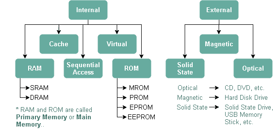
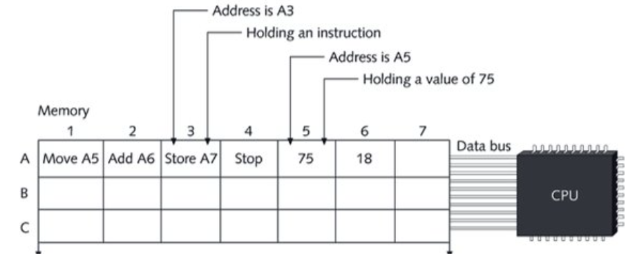
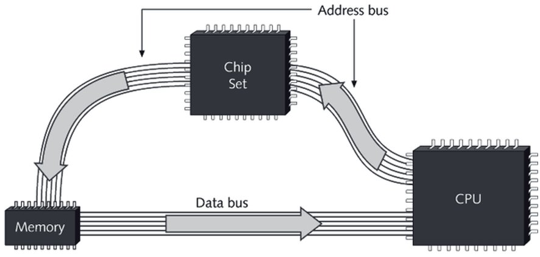
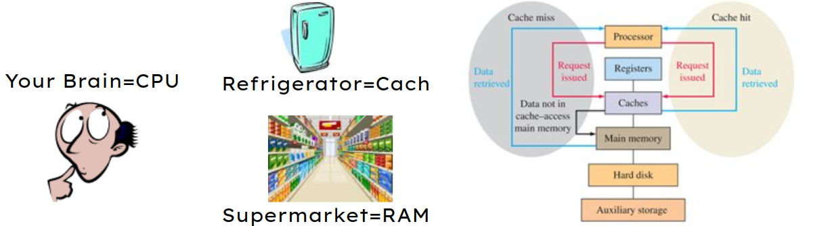
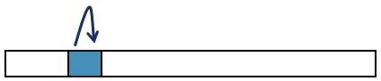
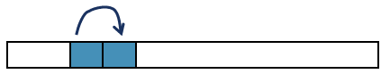
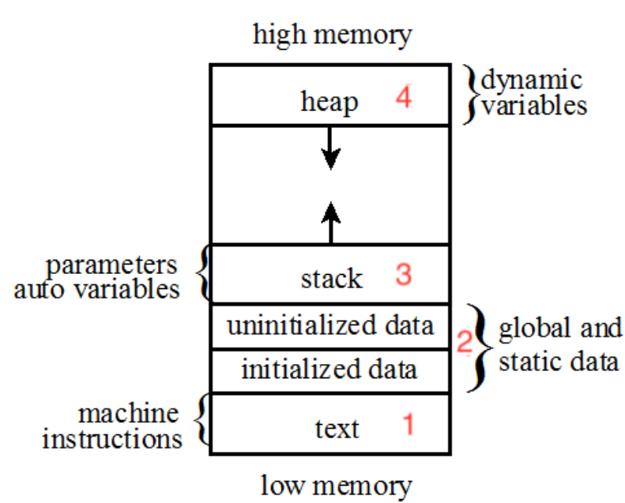
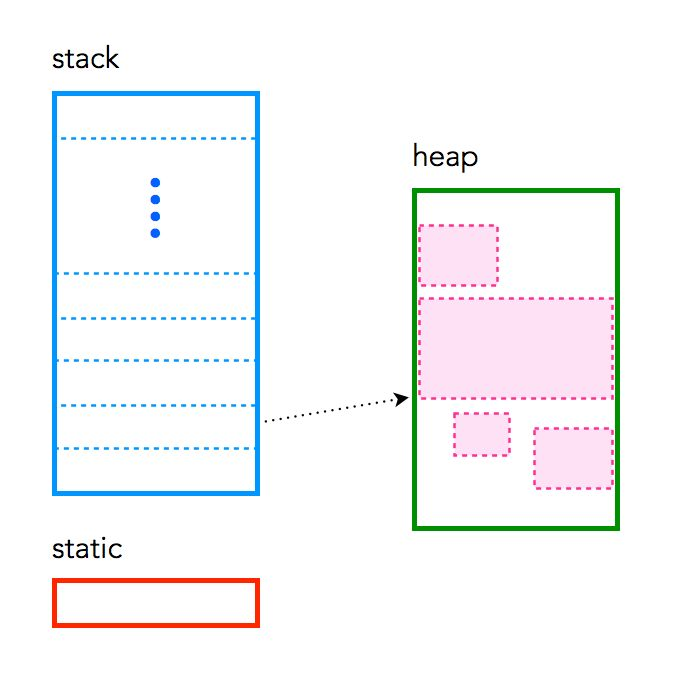
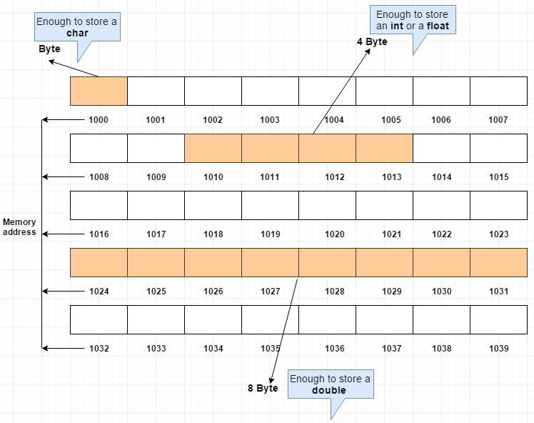

# Pointers And Addressing

    Module Code: ELEE1147

    Module Name: Programming for Engineers

    Credits: 15

    Module Leader: Seb Blair BEng(H) PGCAP MIET MIHEEM FHEA

---

## Memory 

- Anything that stores information
<details>
<summary>Characteristics</summary>

  - Cost
  - Speed
  - Density (size)
  - Non-volatile/volatile
  - Read and write
  - Power
  - Durability
  - Removable

</details>

---

## Types of Memory



<div style="font-size:10px">

Static RAM, Dynamic RAM

Programmable read-only Memory

</div>

---

## SDRAM & DDR

| Standard (Approximate Year Introduced)​ | Operating Voltage​ | Associated RAM Clock Rates​ |Approximate Transfer Rates​|
|---|---|---|---|
|SDRAM (1993)​| 3.3 V​|66 – 133 MHz | 100 – 166  MT/s​ |
|DDR SDRAM (2000)​ |2.6 V, 2.5 V​|  100 – 200 MHz​| 200 – 400  MT/s​|
|DDR2 SDRAM (2003) | 1.8 V, 1.55 V​ |200 – 400 MHz​ | 400 – 1066  MT/s​|
|DDR3 SDRAM (2007)​ | 1.5 V, 1.35 V​  | 400 MHz – 1066 MHz |800 – 2133 MT/s​|
|DDR4 SDRAM (2014)​ |1.2 V​ | 1066 – 1600 MHz​ | 1600 – 3200 MT/s​|
|DDR5 SDRAM (2020)​ |1.1 V​ | 2000 – 4000 MHz​ | 3200 – 8000 MT/s​|

<div style="font-size:10px">

**S**ynchronous **D**ynamic
**D**ouble **D**ata **R**ate

</div>

---

## Memory Access



---

## Data Flow



---

## Cache Analogy



Every time you (CPU ) like to eat or drink (Access) something (Data) you first look into refrigerator (Cache), because it saves lot of time (Fast)! ​
If the item (Data) is not there you have to spend extra time (Slow) to get it (Data) from the supermarket (RAM or main memory)​

---
 
## Principle of Locality 

Programs tend to use data and instructions with addresses near or equal to those they have used recently​

​Temporal Locality: Recently referenced items are likely to be referenced again in the near future​



Spatial Locality: Items with nearby addresses tend to be referenced close together in time​



---

## Locality Example

```c
int sum = 0;​
int a[5];
for ( int i = 0; i < n; i++ )​
{​
  sum += a[i];​
}
```

- Data
  - Access array elements `a[i]` in succession – Spatial Locality ​
  - Reference `sum` each iteration – Temporal Locality ​
- Instructions​
  - Reference instructions in sequence – Spatial Locality​
  - Cycle through loop repeatedly -  Temporal Locality​
  

---

## Stack and Heap


---

## General Memory Layout



- **stack**: stores local variables
>>
- **heap**: dynamic memory for programmer to allocate
>>
- **data**: stores global variables, separated into initialized and uninitialized
>>
- **text**: stores the code being executed

---

## Available Address

By convention, we express these addresses in base 16 numbers:

- the smallest possible address is 0x00000000 (where the 0x means base 16),
>>
- and the largest possible address could be 0xFFFFFFFF.

<details>
<summary>Which is what in decimal?</summary>

$$4,294,967,295_{10}$$

</details>

---

## Stack, Static and Heap 

The great thing about C is that it is so intertwined with memory – and by that I mean that the programmer has quite a good understanding of “what goes where“. C has three different pools of memory.

- **static**: global variable storage, permanent for the entire run of the program.
>>
- **stack**: local variable storage (automatic, continuous memory).
>>
- **heap**: dynamic storage (large pool of memory, not allocated in contiguous order).

---
## Stack, Static and Heap 



---

## Static

Static memory persists throughout the entire life of the program, and is usually used to store things like global variables, or variables created with the static clause. For example:

```c
int somenumber = 5;
```

On many systems this variable uses 4 bytes of memory. This memory can come from one of two places. If a variable is declared outside of a function, it is considered global, meaning it is accessible anywhere in the program. Global variables are static, 

```c
static int somenumber = 5;
```
---

## Stack

- The stack segment is near the top of memory with high address
>>
- Every time a function is called, the machine allocates some stack memory for it.
>>
- The allocation and deallocation for stack memory is automatically done
>>
- Stores variables used on the inside of a function (including the `main()` function). 
>>
- It’s a LIFO, “Last-In,-First-Out”, structure. Every time a function declares a new variable it is “pushed” onto the stack. 

---

## Stack

- The stack is managed by the CPU, there is no ability to modify it
>>
- Variables are allocated and freed automatically
>>
- The stack it not limitless – most have an upper bound
>>
- The stack grows and shrinks as variables are created and destroyed
>>
- Stack variables only exist whilst the function that created them exists

---

## Stack Overflow


A stack overflow occurs if the call stack pointer exceeds the stack bound. The call stack may consist of a limited amount of address space, often determined at the start of the program.

---

## Heap

The heap is the diametrical opposite of the stack. 

- The heap is managed by the programmer, the ability to modify it is somewhat boundless
>>
- The heap is large, and is usually limited by the physical memory available in an embedded environment and in a PC it is stored within paging files on main memory (SSD)
>>
- This is memory that is not automatically managed – you have to explicitly allocate (using functions such as `malloc()`,`calloc()`,`realloc()`), and deallocate (`free()`) the memory. 
>>
- The heap requires pointers to access it
---

```c
#include <stdio.h>
#include <stdlib.h>

int main(void) 
{
    int y = 4; char *str; 

    printf("stack memory: %d\n", y);

    str = malloc(100*sizeof(char)); 
    str[0] = 'm';
    for(int i =0; i< 100; i++)
    {    
        printf("heap memory: %c\n", str[i]); 
    }
    free(str); 
    printf("heap memory: %c\n", str[0]);
    return 0;
}
```

---

## Memory Allocation

a character, 1 byte of memory which is:

$$  8\ bit = 1 * 8$$

an integer or a float, 4 byte of memory which is:
$$  32\ bit = 4 * 8$$

a double value, 8 byte of memory which is :

$$64\ bit = 8 * 8$$


---

## Memory Allocation: Pointers and Addresssing

- In C/C++/C# you can access a variables address using the `&` and `*` symbol.​
>>
- With ‘address of’ `&` we can reference the variable’s address when used with itself. ​
- A ‘pointer’ `*` is a variable that stores the address of another variable. ​
>>
- Be warned, playing with unprotected memory is dangerous and can cause systems to crash and even become unrecoverable.​

---

## Memory Allocation: C

```c
int main ()​
{ // The variable has its own address (unknown to us now)​
  int n = 11; ​
  // this variable stores the address of the other variable​
  int *ptrToN = n; ​
  printf(“n’s address: %d and %d ptrToN value \n”, &n, ptrToN); ​
  printf(“n’s value: %d and ptrToN points to value %d \n”, n, *ptrToN); ​
  return 0;​
}
```

<details>
<summary><br>Output to terminal:</br></summary>

```
n’s address: 0x7fff20494e4c and 0x7fff20494e4c ptrToN value​
n’s value: 11 and ptrToN points to value 11​
```

</details>

---

## Memory Allocation Array: C

```c
int main ()​
{​
  int n = 11, i;​
  char ptr[11] = "hello world";​

  for (i = 0; i < n; i++)
  {​
    printf ("\t%p      ||   ptr[%d]    =    %c\n", &ptr[i],i,ptr[i]);​
  }​
  
  printf("\t%p      ||   ptr[]     =  %c \n", &ptr,*ptr);​
  
  return 0;​
}​
```
​