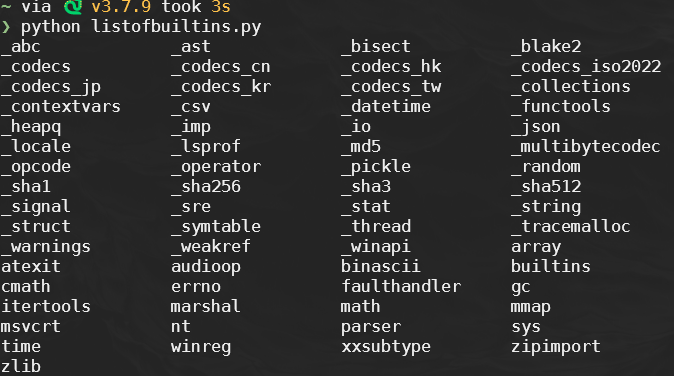

<!-- _footer: "[Download as a PDF](https://github.com/UniOfGreenwich/ELEE1147_Lectures/raw/gh-pages/content/Python_Modules/Python_Modules.pdf)" -->

## Python - Modules

    Module Code: ELEE1147

    Module Name: Programming for Engineers

    Credits: 15

    Module Leader: Seb Blair BEng(H) PGCAP MIET MIHEEM FHEA

---


## Modules in Python

- Modules are reusable pieces of code in Python
- They help organize and manage code by splitting it into separate files
- Modules can be imported into other Python files

---

## Why Use Modules?

- Code reusability: Write once, use many times
- Maintainability: Easier to manage and update code
- Namespace management: Avoids name conflicts by separating code logically

---

<div style="font-size:22px">

```python
# math_utils.py
def mean(numbers):
    """Calculate the arithmetic mean."""
    return sum(numbers) / len(numbers)

# stats_utils.py
def mean(numbers):
    """Calculate the geometric mean."""
    product = 1
    for number in numbers:
        product *= number
    return product ** (1 / len(numbers))
```

```python
import math_utils
import stats_utils

numbers = [1, 2, 3, 4, 5]

# Using the arithmetic mean from math_utils
arithmetic_mean = math_utils.mean(numbers)
print("Arithmetic Mean:", arithmetic_mean)

# Using the geometric mean from stats_utils
geometric_mean = stats_utils.mean(numbers)
print("Geometric Mean:", geometric_mean)
```

</div>

---

## Types of Modules

1. **Built-in Modules**: Pre-installed with Python (e.g., `math`, `datetime`, `sys`)
2. **User-Defined Modules**: Custom modules created by programmers
3. **Third-Party Modules**: Modules that can be installed from the Python Package Index (PyPI) using `pip`

---

## Importing Modules

- Use the `import` statement to bring in a module

    ```python
    import math
    print(math.sqrt(16))  # Output: 4.0
    ```

- You can also import specific functions or variables

    ```python
    from math import pi, sqrt
    print(pi)             # Output: 3.14159...
    print(sqrt(16))       # Output: 4.0
    ```

---

## Creating a Module

1. Write functions and variables in a `.py` file, e.g., `mymodule.py`
2. Import it in another script using `import mymodule`

### Example: `mymodule.py`

```python
# mymodule.py
def greet(name):
    return f"Hello, {name}!"
```

### Example Usage

```python
import mymodule
print(mymodule.greet("Python"))  # Output: Hello, Python!
```

---

## Renaming a Module

- The module name is long or cumbersome to type repeatedly.
- There’s a naming conflict with another module or variable.
- You want a shorter or more intuitive name for readability.
- Use `as` to give a module a different name in your code
  
    ```python
    import math as m
    print(m.sqrt(25))  # Output: 5.0
    ```

    ```python
    import matplotlib.pyplot as plt

    # Now you can use 'plt' instead of 'matplotlib.pyplot'
    plt.plot([1, 2, 3], [4, 5, 6])
    plt.show()
    ```

---

## Commonly Used Built-in Modules

To get a list of all 65 Built-in modules:

```python
>>> import sys
>>> print(*sys.builtin_module_names, sep="/n")
```
    

    
---

## Installing Third-Party Modules

- `pip` - Pip Installs Packages 

    - looks locally first
    - then looks at https://pypi.org/{package}

- ~584k packages!

    ```
    curl https://pypi.org/simple/ | sed -E 's/<[^>]+>//g' > packages.txt && wc -l packages.txt
    ```


- Use `pip`, the package installer for Python

    ```bash
    pip --help
    pip install <package>
    pip install <package>==<version>
    ```
---

## Checking Installed Modules

<div style="font-size:25px">


- Use the following command to see installed packages

    ```bash
    pip list
    ```

- Or check specific package information

    ```
    $ pip show requests

    Name: requests
    Version: 2.31.0
    Summary: Python HTTP for Humans.
    Home-page: https://requests.readthedocs.io
    Author: Kenneth Reitz
    Author-email: me@kennethreitz.org
    License: Apache 2.0
    Location: path/to/file
    Requires: idna, charset-normalizer, certifi, urllib3
    Required-by:
    ```
</div>

---

## Installing packages from a file

```bash
pip install -r requirements.txt
```
- `-r`: Install from the given requirements file. This option can be used multiple times.

- `requirements.txt`: could be any name but the file holds your packages to be installed

    ```
    # requirements.txt
    requests==2.25.1
    numpy>=1.21.0
    pandas
    flask==2.0.1
    ```