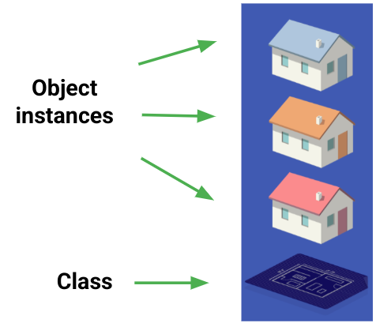
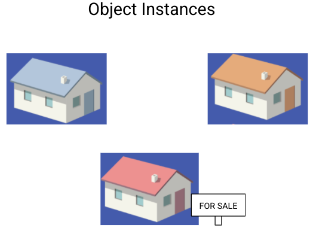

<!-- _footer: "" -->

# Python OOP

    Module Code: ELEE1147

    Module Name: Programming for Engineers

    Credits: 15

    Module Leader: Seb Blair BEng(H) PGCAP MIET MIHEEM FHEA

---

## Object-Oriented Programming in Python

- **What is OOP?**
  - A programming paradigm based on "objects"
  - Combines **data** and **methods** into single entities
  - Focuses on **modularity** and **reusability**
  
- **Key Features:**
  - Encapsulation
  - Inheritance
  - Polymorphism
  - Abstraction

---

## Classes

**Classes** are software programming models - abstractions of the real world or system entities. 

**Classes** define methods that operate on their object instances




<!--

- Classes have *state* and *behaviour*

- *Variables* are used to describe the state of the class and methods are used to describe behaviour

- Classes are collections of objects with common structure, common behaviour, common relationships and common semantics

- Objects belong to a particular class, objects are instances of a particular class 

-->

---

## Classes vs Objects (2)

**House Class**
- Data
    - House color (`String`)
    - Number of windows (`Number`)
    - Is for sale (`Boolean`)

- Behavior
    - `updateColor()`
    - `putOnSale()`




<!--

The House class contains a blueprint of what goes into a House. It has properties like color (which is a String), number of windows (an Int), and whether or not the house is for sale (a Boolean).

The House class also contains methods like updating the house color or putting the house on sale.

We use the class to create object instances of the class. On the right are 3 different House object instances that have different attributes. They have different colors and one is even for sale.

-->

---

## Key Concepts in Python OOP

## 1. Classes and Objects

- **Class**: A blueprint for creating objects.
- **Object**: An instance of a class.

  ```python
  class Dog:
      def __init__(self, name, breed):
          self.name = name
          self.breed = breed

  my_dog = Dog("Alfski", "Norwegian Elkhound")  # Object creation
  ```

- **`self`**: Refers to the instance of the class.

---

## 2. Encapsulation

- **Definition**: Bundling data and methods into a single unit (class) and restricting direct access to some components.

- Example:

  ```python {1,2}
  class BankAccount:
      def __init__(self, balance):
          self.__balance = balance  # Private attribute

      def deposit(self, amount):
          self.__balance += amount

      def get_balance(self):
          return self.__balance
  ```

- Use **getter and setter methods** to access private attributes.

---

## 3. Inheritance


<table style="border-collapse: collapse; border: none; table-layout: fixed; width: 100%;" >
<tr style="border: none;">
<td style="border: none; width:33%;">

- **Definition**: A mechanism to derive a class from another class.
- Python supports single and multiple inheritance.

- Example:

</td>

<td style="border: none; width:33%;">

  <div style="font-size:19px">

  ```python
  class Animal:
      def __init__(self, name):
          self.name = name

      def eat(self):
          print("I can eat!")

      def sleep(self):
          print("I can sleep")

  class Dog(Animal):
      def __init__(self, name, breed):
          # Call the parent class's __init__
          super().__init__(name)  
          self.breed = breed

      def bark(self):
          print("Woof!")

  dog = Dog("Alfski", "Norwegian Elkhound")
  print(dog.name)  # Alfski
  print(dog.breed)  # Norwegian Elkhound
  ```
  </div>

</td>
</tr>
</table>


---

## 4. Polymorphism

- **Definition**: The ability of objects to take many forms.

- Example:

  ```python
  class Bird:
      def fly(self):
          print("Bird flies")

  class Penguin(Bird):
      def fly(self):
          print("Penguins cannot fly")

  def test_fly(bird):
      bird.fly()

  test_fly(Bird())    # Bird flies
  test_fly(Penguin())  # Penguins cannot fly
  ```

---

## 5. Abstraction


- **Definition**: Hiding implementation details while showing essential features.

- Achieved using abstract base classes.

  <div style="font-size:23px">

  ```python
  from abc import ABC, abstractmethod

  class Shape(ABC):
      @abstractmethod
      def area(self):
          pass ## keyword for placeholder

  class Circle(Shape):
      def __init__(self, radius):
          self.radius = radius

      def area(self):
          return 3.14 * self.radius ** 2

  circle = Circle(5)
  print(circle.area())  # 78.5
  ```
 </div>

---

## Special Methods in Python

<div style="font-size:22px">

- **Magic/Dunder Methods**: Special methods with double underscores.
- Examples:
  - `__init__`: Initialize an object.
  - `__str__`: String representation of an object.
  - `__add__`: Define addition behavior for objects.

    ```python
    class Vector:
        def __init__(self, x, y):
            self.x = x
            self.y = y

        def __add__(self, other):
            return Vector(self.x + other.x, self.y + other.y)

        def __str__(self):
            return f"Vector({self.x}, {self.y})"

    v1 = Vector(2, 3)
    v2 = Vector(5, 6)
    print(v1 + v2)  # Vector(7, 9)
    ```
</div>

---

## Why Use OOP?

- **Benefits:**
  - Code reusability through inheritance.
  - Modularity for easier debugging and maintenance.
  - Encapsulation enhances data security.
  - Polymorphism makes systems more flexible.

- **Real-World Use Cases:**
  - GUI applications
  - Games
  - Web frameworks

---

## Summary

- OOP provides a structured and modular way of programming.
- Key concepts:
  - Classes and Objects
  - Encapsulation
  - Inheritance
  - Polymorphism
  - Abstraction
  - `super()` for parent class method calls
- Use OOP for scalable and maintainable code.