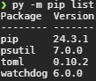
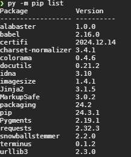

<!-- _footer: "[Download as a PDF](https://github.com/UniOfGreenwich/ELEE1147_Lectures/raw/gh-pages/content//c/Users/SebDev/Git/Teaching/ELEE1147/Lectures/content/ReproducibleDevEnv/ReproducibleDevEnv.pdf)" -->

# Reproducible Developement Environments

    Module Code: ELEE1147

    Module Name: 

    Module Leader: Seb Blair BEng(H) PGCAP MIET MIHEEM FHEA

---


## Reproducibility definition

A setup where the software environment, including all dependencies, configurations, and tools, can be consistently recreated across different machines and over time, ensuring that the code runs identically regardless of where or when it is executed.

**TLDR**

A reproducible development environment is a setup where the software environment can be consistently recreated across different machines and over time.

----

## Virtual Environments with pip

<div style="font-size:22px">

- **What Are They?**  
  - Isolated environments for Python projects.
- **Common Tools:**  
  - **virtualenv:** Creates separate directories with their own libraries.
  - **pipenv:** Combines package management with virtual environments.
- **Benefits:**  
  - Avoid package version conflicts.
  - Customize the PATH variable to prioritize local libraries.

</div>






---

## Package Management

A package manager is a program that manages (installs, upgrades, removes) a given target software and the target’s software dependencies.

Features:

1. They install packages by compiling the packages from source or downloading binary files 

2. They attempt to solve dependency 

3. They operate on a local or system-wide environment

---

## Package Manager Types

**Binary package managers**: install software by downloading pre-compiled files and placing them in certain paths.


**From-source package managers**: install software primarily by downloading source code, compiling it, and placing it in certain paths. However, from-source package managers may optionally use a binary cache, where they can download a pre-compiled binary, a fallback!

---

**Package Managers**


---

## Hyrums Law

With a sufficient number of users of an API, it does not matter what you promise in the contract: all observable behaviors of your system will be depended on by somebody.<sup><a href="#footnote-1">[1]</a></sup>

<div style="font-size:20px; padding-top:60px" id="footnote-1">

[https://www.hyrumslaw.com/](https://www.hyrumslaw.com/) 

</div>


---

## Sermantic Versioning

<div style="font-size:22px">

- Given a version number MAJOR.MINOR.PATCH, increment the:

- MAJOR version when you make incompatible API changes
- MINOR version when you add functionality in a backward compatible manner
- PATCH version when you make backward compatible bug fixes

  ```
  Django 1.3
  Django 1.2.5
  Django 1.2.4
  Django 1.2.3
  Django 1.2.2
  Django 1.2.1
  ```

</div>


---


## Dependency Constraints

A dependency constraint occurs when operating some versions of A requires operating B (operate usually means compile or run). Since

<div align=center style="font-size:22px">

```
+-------------------+    +-------------------+     +-------------------+
| Package A         |    | Package A         |     | Package A         |
|-------------------|    |-------------------|     |-------------------|
| Version 0.50      |    | Version 0.58      |     | Version 0.55      |
| - No dependency   |    | - Requires B 3.8  |     | - Requires B 3.7  |
|   on B            |    |   to 3.11         |     |   to 3.10         |
+-------------------+    +-------------------+     +-------------------+
                                   |                         |
                                   v                         v
                         +-------------------+     +-------------------+
                         | Package B         |     | Package B         |
                         |-------------------|     |-------------------|
                         | Version 3.8 - 3.11|     | Version 3.7 - 3.10|
                         +-------------------+     +-------------------+
```

</div>

---

## Diamond Dependency

Library A depends on libraries B and C, and both B and C depend on D—but B requires D version 1.1, and C requires D version 1.2.


---

## Automate Reproducibility 

- installer scripts are great for this
  - Do not rely on the human... they will make mistakes
  - Most installers look like `bash install.sh`
  - `curl https://github,com/<user>/<repo>/install.sh | bash`

---

## Build our environment

Fast tracking; 

- let's start off with using `curl`, pipe (`|`) and `bash`:

  ```
  curl https://raw.githubusercontent.com/uniofgreenwich/VirtualEnv/master/install.sh | bash
  ```

- Pipe `|` is the key next to the `z` key, use the `shift` at the same time

---

## Building our environment

Go to the Markdown Book start:

[Virtual Environments](https://uniofgreenwich.github.io/ELEE1147_Exercises/VirtualEnvironments/VirtualEnvironments.html)