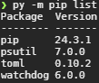

<!--
# Metadata
title: Reproducible Developement Environments
author: Seb Blair (CompEng0001)
description: Lecture slides on Reproducible Developement Environments
keywords: module handbook
lang: en

# Slide styling
theme: uog-theme
_class: lead title
paginate: true
_paginate: false
transition: fade 250ms

style: |
  header em { font-style: normal; view-transition-name: header; }
  header strong { font-weight: inherit; view-transition-name: header2; }
  header:not:has(em) { view-transition-name: header; }
  header:not:has(strong) { view-transition-name: header; }
-->

<style scoped>
h1 {
  view-transition-name: header;
  display: flex;
  align-items: center;
  margin: 0 auto;
}
</style>

# Reproducible Developement Environments

<div align=center style="font-size:76px; padding-left:300px;padding-right:300px;" >

```py
module = Module(
    code="ELEE1147",
    name="Programming for Engineers",
    credits=15,
    module_leader="Seb Blair BEng(H) PGCAP MIET MIHEEM FHEA"
)
```

</div>

<!-- _footer: "[Download as a PDF](https://github.com/UniOfGreenwich/ELEE1147_Lectures/raw/main/content/ReproducibleDevEnv/ReproducibleDevEnv.pdf)" -->

---

<style scoped>
h1 { view-transition-name: header2; }
</style>

<!-- header: "_Reproducible Developement Environments_" -->
<!-- class: lead -->

<div>

## Reproducibility definition

</div>

<div style="padding-top:100px">

A setup where the software environment, including all dependencies, configurations, and tools, can be consistently recreated across different machines and over time, ensuring that the code runs identically regardless of where or when it is executed.

<br>

**TLDR**

A reproducible development environment is a setup where the software environment can be consistently recreated across different machines and over time.

</div>

----

<div style="padding-bottom:50px">

## Virtual Environments with pip

</div>

<div class="columns-2">
<div style="font-size:28px; padding-top:50px">

- **What Are They?**  
  - Isolated environments for Python projects.
- **Common Tools:**  
  - **virtualenv:** Creates separate directories with their own libraries.
  - **pipenv:** Combines package management with virtual environments.
- **Benefits:**  
  - Avoid package version conflicts.
  - Customize the PATH variable to prioritize local libraries.

</div>

<div style="padding-top:100px;padding-left:170px;">

**Virutal Environment**


**Host Environment**


</div>
</div>

---

<div style="padding-bottom:50px">

## Package Management

</div>

<div>

A package manager is a program that manages (installs, upgrades, removes) a given target software and the target’s software dependencies.

<br>

Features:

- They install packages by compiling the packages from source or downloading binary files 
<br>
- They attempt to solve dependency 
<br>
- They operate on a local or system-wide environment

</div>

---

<div style="padding-bottom:50px">

## Package Manager Types

</div>

<div>

- **Binary package managers**: 
  - install software by downloading pre-compiled files and placing them in certain paths.

<br>

- **From-source package managers**: 
  - install software primarily by downloading source code, compiling it, and placing it in certain paths. 
  - However, from-source package managers may optionally use a binary cache, where they can download a pre-compiled binary, a fallback!

</div>

---

**Package Managers**


---

<!-- _footer: https://www.hyrumslaw.com/ -->

<div style="padding-bottom:100px">

## Hyrums Law

</div>

<div class="columns-2">
<div style="padding-top:150px">

With a sufficient number of users of an API, it does not matter what you promise in the contract: all observable behaviors of your system will be depended on by somebody.


</div>
<div>


</div>
</div>

---

<div style="padding-bottom:50px">

## Sermantic Versioning

</div>

<div class="columns-2">
<div style="padding-top:10px">

- A version number MAJOR.MINOR.PATCH:

  

</div>
<div style="padding-top:200px">

  ```
  Django 1.3
  Django 1.2.5
  Django 1.2.4
  Django 1.2.3
  Django 1.2.2
  Django 1.2.1
  ```

</div>
</div>


---

<div style="padding-bottom:50px">

## Dependency Constraints

</div>

<div class="columns-2">
<div style="padding-top:80px">

A dependency constraint occurs when operating some versions of A requires operating B (operate usually means compile or run). Since

</div>

<div align=center style="font-size:22px">

```
+-------------------+    +-------------------+     +-------------------+
| Package A         |    | Package A         |     | Package A         |
|-------------------|    |-------------------|     |-------------------|
| Version 0.50      |    | Version 0.58      |     | Version 0.55      |
| - No dependency   |    | - Requires B 3.8  |     | - Requires B 3.7  |
|   on B            |    |   to 3.11         |     |   to 3.10         |
+-------------------+    +-------------------+     +-------------------+
                                   |                         |
                                   v                         v
                         +-------------------+     +-------------------+
                         | Package B         |     | Package B         |
                         |-------------------|     |-------------------|
                         | Version 3.8 - 3.11|     | Version 3.7 - 3.10|
                         +-------------------+     +-------------------+
```

</div>
</div>

---
<div style="padding-bottom:50px">

## Diamond Dependency

</div>

<div class="columns-2">
<div style="padding-top:80px">

- Library A depends on libraries B and C
<br>
- Both B and C depend on D
<br>
- But B requires D version 1.1, 
<br>
- and C requires D version 1.2.

</div>

<div align=center style="padding-left:200px;padding-top:150px;font-size:22px">


</div>
</div>

---

<div style="padding-bottom:100px">

## Automate Reproducibility 

</div>

<div>

- installer scripts are great for this

<br>

  - Do not rely on the human... they will make mistakes
<br>
  - Most installers look like `bash install.sh`
<br>
  - `curl https://github.com/<user>/<repo>/install.sh | bash`

</div>

---

<div style="padding-bottom:100px">

## Build our environment

</div>

<div>

Fast tracking; 
<br>
- let's start off with using `curl`, pipe (`|`) and `bash`:
<br>

  <div style="font-size:38px">

  ```
  curl https://raw.githubusercontent.com/uniofgreenwich/VirtualEnv/master/install.sh | bash
  ```

  </div>

<br>

- Pipe `|` is the key next to the `z` key, use the `shift` at the same time

<br>

</div>

---

<div style="padding-bottom:200px">

## Building our environment

</div>

Go to the Markdown Book start:

[Virtual Environments](https://uniofgreenwich.github.io/ELEE1147_Exercises/VirtualEnvironments/VirtualEnvironments.html)