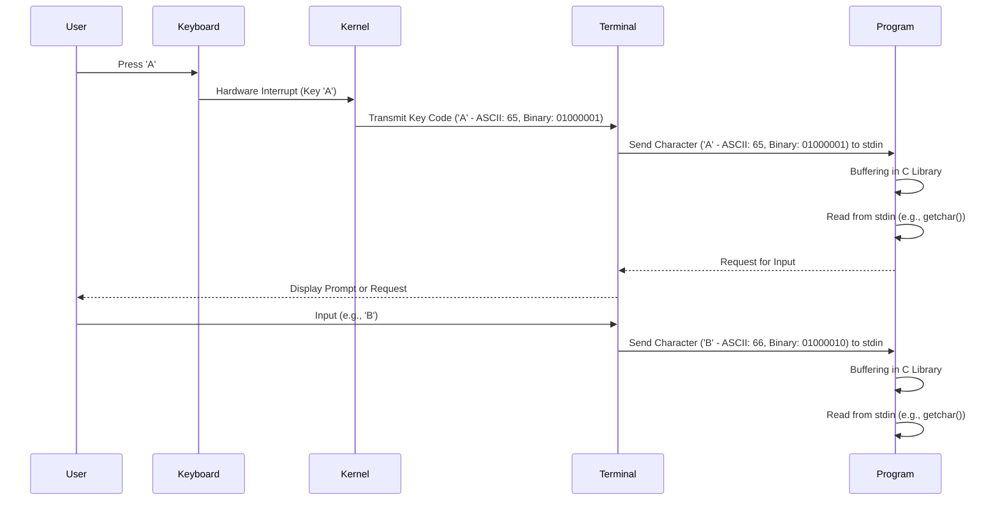
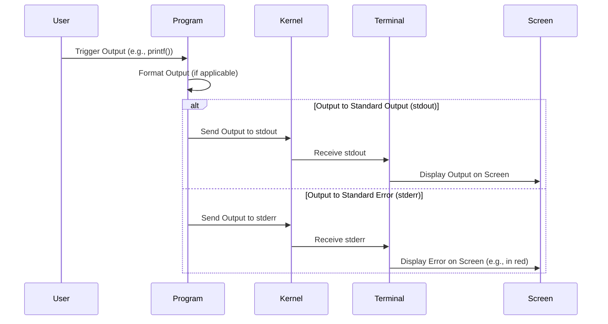

# Streams

    Module Code: ELEE1147

    Module Name: Programming for Engineers

    Credits: 15

    Module Leader: Seb Blair BEng(H) PGCAP MIET MIHEEM FHEA

---

## Introduction to Streams

- Streams are sequences of data elements.
- In C, we commonly work with three standard streams:
  - Standard Input (**stdin**)
  - Standard Output (**stdout**)
  - Standard Error (**stderr**)


---

## Standard Input (stdin)

- **stdin** is the **st**andar**d** **in**put stream.
- It is used to read input from the user or from another program.
- Functions like `scanf()` and `getchar()` read from stdin.

```c
int num;
printf("Enter a number: ");
scanf("%d", &num);
```
- `scanf()` reads input from the standard input (usually the keyboard) and stores it in the specified variable.

- In this example, it waits for the user to input an integer and stores it in the variable `num`.

---


## Standard Input flow:



---

## Standard Output (stdout)

- **stdout** is the **st**andar**d** **out**put stream.

- It is used to display output to the user or another program.

- Functions like `printf()` and `putchar()` write to stdout.

```c
int result = 42;
printf("The answer is: %d\n", result);
```

---

## Standard Error (stderr)

- **stderr** is the **st**andar**d** **err**or stream.

- It is used to display error messages or diagnostic information.

- It's particularly useful to separate error messages from regular output.

```c
FILE *file = fopen("nonexistent.txt", "r");
if (file == NULL) {
    fprintf(stderr, "Error: Unable to open the file!\n");
}
```

---



---

## Stream Functions in C
C provides functions to interact with streams in the <stdio.h> header, like these for handling files:

- `fopen()`: Opens a file stream.

- `fclose()`: Closes a file stream.

- `fprintf()`: Writes to a stream with formatting.

- `fscanf()`: Reads from a stream with formatting.

--- 

## File Operations in C: Open, Read, Write, Execute

In C programming, file operations are crucial for interacting with files on a computer system. The primary operations include:
 - opening files for: 
   - reading from them,
   - writing to them,
 - and executing them.
---

## Opening a File

To operate on a file, you must first open it using the `fopen` function. This function allows you to specify the file's path, mode (read, write, execute), and returns a file pointer for further operations.

Example:
```c
FILE *filePtr = fopen("example.txt", "r"); // Open for reading
```

---

## File Modes

- **Read (`"r"`) Mode**: Open a file for reading. The file must exist.

- **Write (`"w"`) Mode**: Open a file for writing. If the file exists, its content is truncated; if not, a new file is created.

- **Append (`"a"`) Mode**: Open a file for writing, but append data to the end. If the file doesn't exist, it is created.

---


## Write and Read

```c
// Write Mode
FILE *writeFile = fopen("example.txt", "w");
fprintf(writeFile, "Hello, World!");
fclose(writeFile);

// Append Mode
FILE *appendFile = fopen("example.txt", "a");
fprintf(appendFile, "\nAppended Content");
fclose(appendFile);
```
---

## Single Write Instance

**Only one** instance of a file can be opened for writing at a time. This prevents multiple processes from simultaneously modifying the same file, avoiding data corruption.

Example:

```c
FILE *writeFile1 = fopen("example.txt", "w");

// Error: Cannot open for write concurrently
FILE *writeFile2 = fopen("example.txt", "w");
```

---

## Dirty Files
When a file is opened for writing, it becomes a "dirty" file. This means changes are made in memory but not yet saved to disk. To persist changes, use the fclose function.

Example:

```c
FILE *dirtyFile = fopen("example.txt", "w");
fprintf(dirtyFile, "Hello, World!");
fclose(dirtyFile); // Save changes to disk
```

---

## Why Close Files?
When working with files in C, it's crucial to close them properly after operations. Failing to do so can lead to unexpected behavior, data corruption, and resource leaks.
1. **Data Persistence:** Closing a file ensures that any changes made during read or write operations are saved to the underlying storage. Without proper closure, changes may be lost.

2. **Resource Management:** File operations involve system resources. Closing a file releases these resources, preventing potential memory leaks or system resource exhaustion.

3. **Avoiding Data Corruption:** Closing files properly helps avoid data corruption, especially when multiple programs or processes access the same file. It ensures exclusive access when needed.

----

## Proper File Closure Example

```c
#include <stdio.h>

int main() {
    FILE *filePtr = fopen("example.txt", "w");

    if (filePtr != NULL) {
        fprintf(filePtr, "Hello, World!");
        fclose(filePtr); // Properly close the file
    } else {
        printf("Error opening the file!\n");
    }

    return 0;
}
```