<!--
# Metadata
title: Version Control Systems
author: Seb Blair (CompEng0001)
description: Lecture slides on version control systems.
keywords: module handbook
lang: en

# Slide styling
theme: uog-theme
_class: lead title
paginate: true
_paginate: false
transition: fade 250ms

style: |
  header em { font-style: normal; view-transition-name: header; }
  header strong { font-weight: inherit; view-transition-name: header2; }
  header:not:has(em) { view-transition-name: header; }

  -->

<style scoped>
h1 {
view-transition-name: header;
display: flex;
align-items: center;
margin: 0 auto;
}
</style>


# Version Control Systems

<div align=center style="font-size:76px;padding-left:300px;padding-right:300px;" >

```py
module = Module(
  code="ELEE1147",
  name="Programming for Engineers",
  credits=15,
  module_leader="Seb Blair BEng(H) PGCAP MIET MIHEEM FHEA"
)
```

</div>

<!-- _footer: "[Download as a PDF](https://github.com/UniOfGreenwich/ELEE1147_Lectures/raw/main/content/VersionControlSystems/versionControlSystem.pdf)" -->

---

<style scoped>
h1 {
view-transition-name: header;
display: flex;
align-items: center;
margin: 0 auto;
}
</style>


<!-- header: "_Version Control Systems_" -->

## What are VCS?

<div style="padding-top:80px">

- Tracking and managing changes: 
- Work faster and more reliably

- Keeps track of all code modifications:
- Specialised Database (Repository)

- Solves Common Team Problems:
-  Conflicitng concurrent work, 
- incompatiables due to concurrent working, 
- having unstable releases

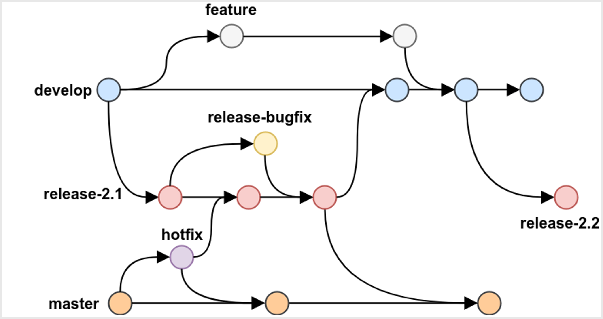

---

## Common Benefits of VCS

<div style="font-size:32px;padding-left:100px;padding-right:200px;padding-top:100px;">

**Historical information​** : Looking at the history of changes it is a lot easier to find where bugs have originated. Also, it might be easier to find the right team member best suited to fix an error.​

**Branching​**: Working concurrently on multiple issues, without interference.​ Working on different types of releases.​

**Merging​** : Making sure that team members work does not interfere with each other.​

**Traceability​** : Team members work more fluently together.​

**Testing and Documentation​**: Comments for each change and its association help producing better documentation​. Creating tests is easier​.

</div>

---


## Types of VCS

<div style="font-size:32px;padding-left:100px;padding-right:200px;padding-top:100px;">

- **Local**:
  - Creates a database on the your hardware ​
- **Centralised​**:
  - History of changes kept in a single database in a central server.​
  - Clients need to constantly communicate with the database and receive a partial working copy.​

- **Distributed​**:
  - Single database in a central server that is also distributed among all clients​
  - Each client has a full working copy of the repository​

</div>

---

## VCS - List


<div style="font-size:26px">

**Local Data Model**
- Revision Control System (RCS) [OS]
- Source Code Control System (SCCS) [OS]
- The Librarian [P]
- Panvalet [P]

**Client Server model**
- Concurrent Versions System [OS]
- Subversion (SVN) [OS]
- Vesta [OS]
- AccuRev [P]
- Autodesk Vault [P]
- CADES [P]
- ...
- Vault [P]
- Visual Source Safe [P]

</div>

---

## VCS - List


**Distrubted Model**

- ArX [OS]
- Bazaar [OS]
- BitKeeper [OS]
- Fossil [OS]
- Git [OS]
- GNU Arch [OS]
- Mecurial [OS]
- Code Co-op [P]
- Sun WorkShop TeamWare [P]
- Plastic SCM [P]
---

<style scoped>
h1 { view-transition-name: header2; }
</style>

<!-- _class: lead -->

# Git


<a name="git"></a>

<!-- _footer: https://git-scm.com/ -->

---

<!-- header: "_Version Control Systems_ > **Git**" -->

<div style="padding-top:100px">

- Developed by Linus Torvalds (you know the inventor/creator of Linux) to manage the development of Linux

- Over 76k commits to date (2025)

- First ever commit - `e83c5163316f89bfbde7d9ab23ca2e25604af290` (21 years ago)

- Commit message: `Initial revision of "git", the information manager from hell`

<div style="padding-left:350px;padding-right:350px;">

```

                  GIT - the stupid content tracker

"git" can mean anything, depending on your mood.

- random three-letter combination that is pronounceable, and not
  actually used by any common UNIX command.  The fact that it is a
  mispronounciation of "get" may or may not be relevant.
- stupid. contemptible and despicable. simple. Take your pick from the
  dictionary of slang.
- "global information tracker": you're in a good mood, and it actually
  works for you. Angels sing, and a light suddenly fills the room. 
- "goddamn idiotic truckload of sh*t": when it breaks

...

```

<!-- _footer: https://github.com/git/git/tree/e83c5163316f89bfbde7d9ab23ca2e25604af290 -->
---


## Characteristics 

<div style="font-size:28px;padding-left:100px;padding-right:200px;padding-top:80px;">

- A very popular VCS
- Performance
- Better performance compared to competitors
- Deals with the data in the file rather than the file properties
- Security
- Designed to provide security
- Uses SHA-256 encryption
- Flexibility
- Non-linear development
- Detailed log of information

</div>

---

## Global Configuration

`git config` is a allows you to set important configuration settings, it’s easy to get Git to work exactly the way you, your company, or your group needs it to.

<div class="columns-2">

<div>

  Location of config:
  ```
  $HOME\.gitconfig
  ```

  ```
  ~/.gitconfig
  ```

  Set via CLI:

  ```
  $ git config --global user.name "your user name"
  $ git config --global user.email "your email"
  ```

  or modify the configuration file directly:

  ```
  $ git config --global --edit
  ```

  ```
  <nano/vim/vi/...> ~/.gitconfig
  ```

</div>

<div style="padding-top:125px">
  
  .gitconfig file
  
  ```
  [user]
          name = CompEng0001
          email = s.blair@gre.ac.uk
  [core]
          editor = vim
          excludesFile = "~/.config/git/.gitignore"
          attributesFile = "~/.config/git/.gitattributes"
  [grep]
          lineNumber = true
          patternType = perl                               
  ```

</div>
</div>

<!-- _footer: https://git-scm.com/docs/git-config -->

---


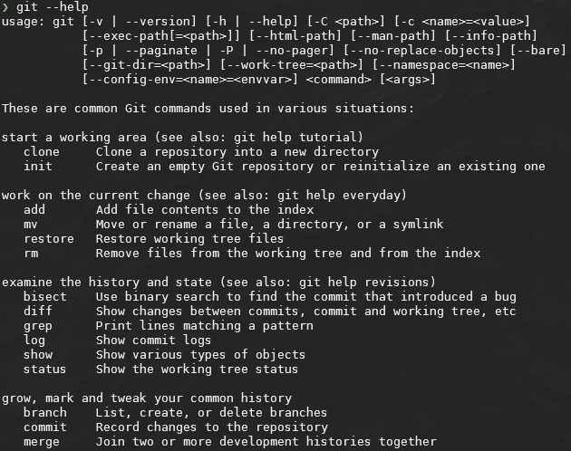

## Functions

<style scoped>ul { list-style: square; padding: 100; }</style>

<div style="font-size:28px;padding-left:100px;padding-right:200px;padding-top:50px;">

All commands are prepended with `git`

- `init` initialise a folder as a git repository

- `fetch`, `pull`: Get a working copy of a repository

- `add`,`commit`,`push`: Record a change or changes in at least one of the files stored in the repository.

- `branch`: Create a copy of a repository to be worked independently.

- `merge`: Collates changes of two different copies of a repository.

- `log`: Records information of each change within a repository

---

<style scoped>
  code {
    --highlight-line-begin: 11;
    --highlight-lines: 1;
    --highlight-line-color: rgb(255 255 255 / 20%);
  }
</style>

## Structure of the .git directory


<div style="padding-left:400px;padding-right:400px;padding-top:50px;">

```
.git/
├── objects/               # Git's object database
│   ├── pack/              # Compressed repository data
│   └── info/              # Additional object information
│   └── [sha1]/            # Object storage using hash prefixes
├── refs/                  # Reference storage
│   ├── heads/             # Branch references
│   ├── tags/              # Tag references
│   └── remotes/           # Remote repository references
├── HEAD                   # Points to current branch
├── config                 # Repository configuration
├── index                  # Staging area information
├── hooks/                 # Scripts for automation
│   ├── pre-commit         # Run before commit is created
│   └── post-commit        # Run after commit is created
├── info/                  # Repository information
│   └── exclude            # Local ignore patterns
└── logs/                  # Reference history
    ├── HEAD               # History of HEAD updates
    └── refs/              # Branch update history
```

</div>

---

<!-- _class: lead -->

<div align=center style="font-size:28px;">

# Example

</div>

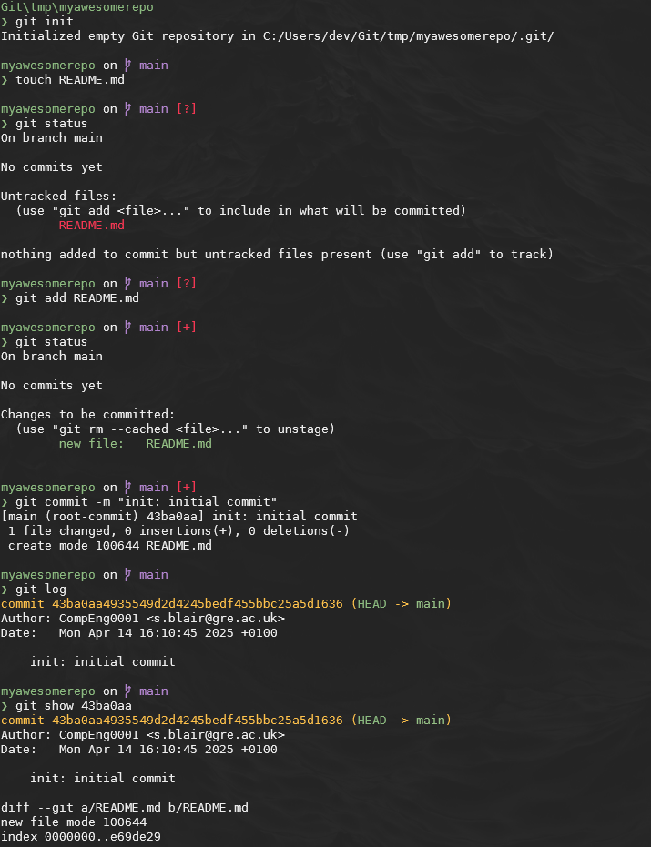

---

<!-- header: "Version Control Systems > Git" -->


## Repository Staging Area

<style scoped>ul { list-style: square; padding: 100; }</style>

<div style="font-size:28px;padding-left:100px;padding-right:200px;padding-top:80px;">

- As part of the version control features there is the **Staging Area**. ​

- This is feature enables the developer to move files independently of each other to the repository.

<div style="padding-left:50px">

```
git add <filename>
```
```
git add .
```

```
git commit 
```
```
git commit -a
```

```
git commit -m
```

```
git commit -am
```

</div>

--- 

<!-- header: "_Version Control Systems > Git_" -->
<!-- _class: lead -->

<style scoped>
h1 { view-transition-name: header2-alt; }
</style>

# Hashing 


<a name="hashing"></a>

---

<style scoped>
header strong { view-transition-name: header2-alt; }
</style>

<!-- header: "_Version Control Systems > Git_ > **Hashing**" -->

- Often referred to as a commit hash, is a unique identifier for every single commit in a Git repository
-  SHA-1 cryptographic hash function
  - 40-character string of hexadecimal characters (0-9 and a-f)
- Hashes are calculated based on the contents of the files in the commit, the metadata of the commit (like timestamp and author), and the parent commit's hash.


<div style="padding-top:10px;">

- Comparing hashes to see differences <span style="font-size: 38px">`git diff <a_hash> <another_hash>`</span>

<div style="font-size:38px;padding-left:100px;padding-right:200px;padding-top:10px;">

```sh
git diff 43ba0aa4935549d2d4245bedf455bbc25a5d1636 a1b2c3d4e5f67890abcdef1234567890abcdef12
```

</div>

---

## Collisions!

- No two hashes should ever be the same!

- A hash collision occurs when two different inputs generate the same output hash.

- Output length: **160 bits**

Possible hashes:  

$$2^{160} = 1.4615016373309029182036848327163 \times 10^{48}$$

or if you prefer: 

-  $2^{160}$ grains of sand ($0.5mm^3$) would fill $~500$ trillion Jupiters

The probability $P(n)$ of at least one collision is approximately:

| $n$ (number of hashes)     | $P(n) (collision probability)   |
|---------------------------:|:--------------------------------|
| 1                          | $\approx 0$                     |
| $1 \cdot 10^6$                     | $< 10^{-47}$            |
| $1.4 \times 10^{24}$ (septillion)      | $\approx 0.5$ (50%) |

<!--

- 119,000 Juipters with sand ipv6

- 500 trillion Jupiters with sand to match

-->
---

## Example of `sha1sum`


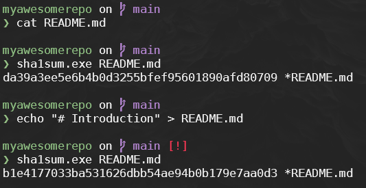

<div style="font-size:38px;;padding-top:200px;">

```
sha1sum.exe <<< hello
f572d396fae9206628714fb2ce00f72e94f2258f *-
```

```
sha1sum.exe <<< Hello
1d229271928d3f9e2bb0375bd6ce5db6c6d348d9 *-
```

</div>

---

<!-- header: "_Version Control Systems > Git_" -->
<!-- _class: lead -->

<style scoped>
h1 { view-transition-name: header2-alt; }
</style>

# Branching

<a name="branching"></a>

---

<!-- header: "_Version Control Systems > Git_ > **Branching**" -->
<!-- _class: lead -->

<style scoped>
header strong { view-transition-name: header2-alt; }
</style>


## Branching

<div style="font-size:30px;padding-left:100px;padding-right:200px;">

- **Master/Main**: The default development branch. Whenever you create a Git repository, a branch named "`master`" or "`main`" is created, and becomes the active branch. 

- **HotFix**: To patch urgent issues found in the `master`/`main` branch (e.g., bugs in production)

- **Release**: To prepare a new production release

- **Develop**: This is another branch, which is a way to **edit/develop/test** code without changing the `main` branch.

- **Feature**: For developing new features or enhancements. 

---

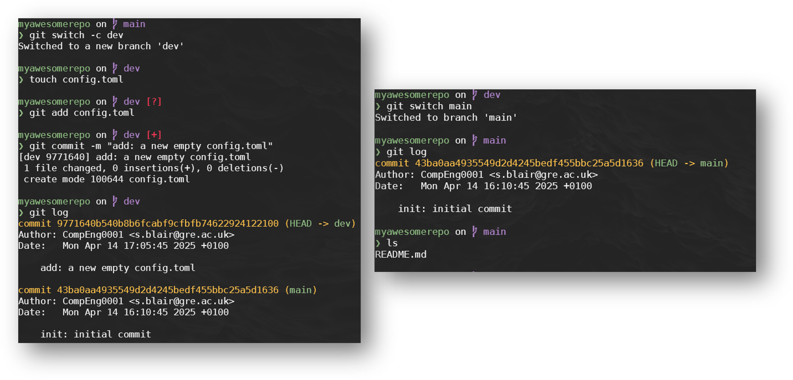

<div align=center style="font-size:28px;padding-top:380px;">

## Example

</div>


---
<!-- header: "_Version Control Systems > Git_" -->
<!-- _class: lead -->

<style scoped>
h1 { view-transition-name: header2-alt; }
</style>


# Merging & Rebasing


---

<!-- header: "_Version Control Systems > Git_ > **Merging & Rebasing**" -->

<style scoped>
header strong { view-transition-name: header2-alt; }
</style>

- `merge`
  - A merge commit has two or more parent commits – one for each branch that was merged
  - Merging happens at the commit level – Git merges entire commits together
  - This keeps the history of that other feature branch in case you ever need it.

- `rebase`
  - This will take the changes of your feature branch and append them to the main branch, which effectively removes the history as a separate branch of work.

<div style="padding-left:250px">

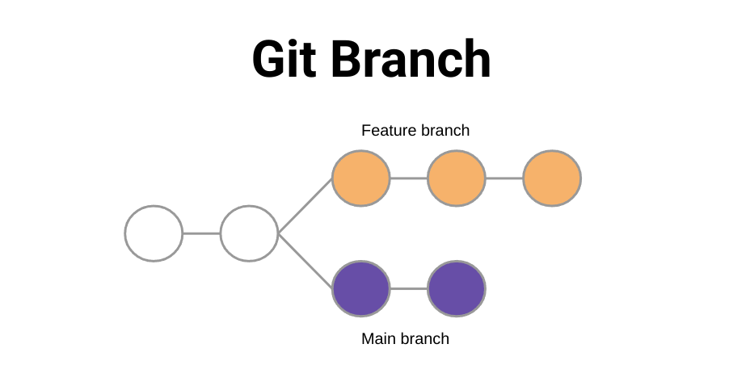
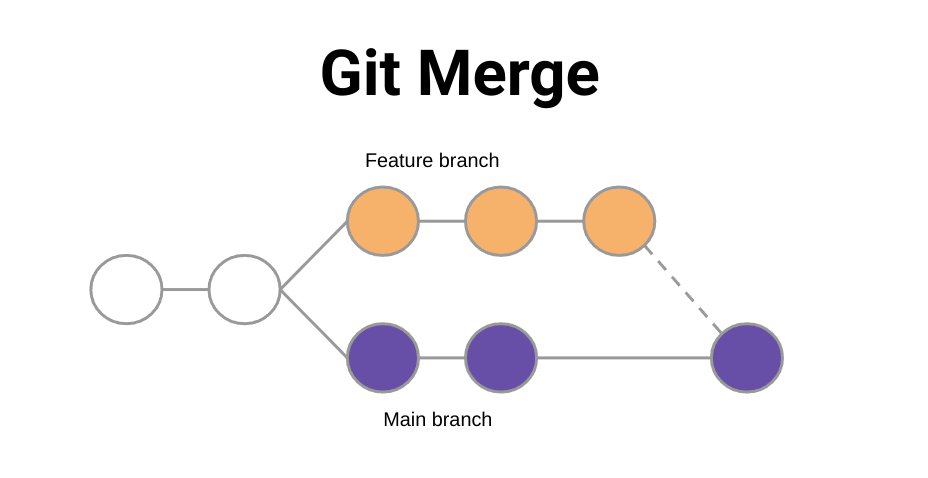
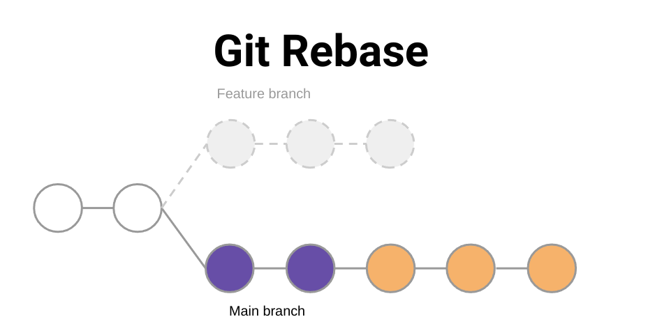

</div>

---
<!-- header: "_Version Control Systems > Git_" -->
<!-- _class: lead -->

<style scoped>
h1 { view-transition-name: header2-alt; }
</style>


# Distribution

<a name="dist"></a>

---

<!-- header: "_Version Control Systems > Git_ > **Distribution**" -->

<style scoped>
header strong { view-transition-name: header2-alt; }
</style>

## Flow Diagram

<div style="padding-top:160px">


</div>

---

<!-- header: "Version Control Systems" -->

<!-- _class: lead -->

# Hosts

<style scoped>
h1 { view-transition-name: header2-alt; }
</style>

<a name="version-control-hosts"></a>

---

<!-- header: "_Version Control Systems_ > **Hosts**" -->

<style scoped>
header strong { view-transition-name: header2-alt; }
</style>


## List


- TaraVault
- BitBucket
- SourceForg
- GitLab
- Gogs
- GitBucket
- GitHub
- AWS CodeCommit
- BeanStalk
- Phabricator
- ...many more

---


<!-- header: "Version Control Systems > Hosts" -->

<!-- _class: lead -->

<style scoped>
h1 { view-transition-name: header2; }
</style>

# GitHub


<a name="github"></a>

---

<!-- header: "_Version Control Systems > Hosts_ > **GitHub**" -->

<style scoped>
header strong { view-transition-name: header2; }
</style>

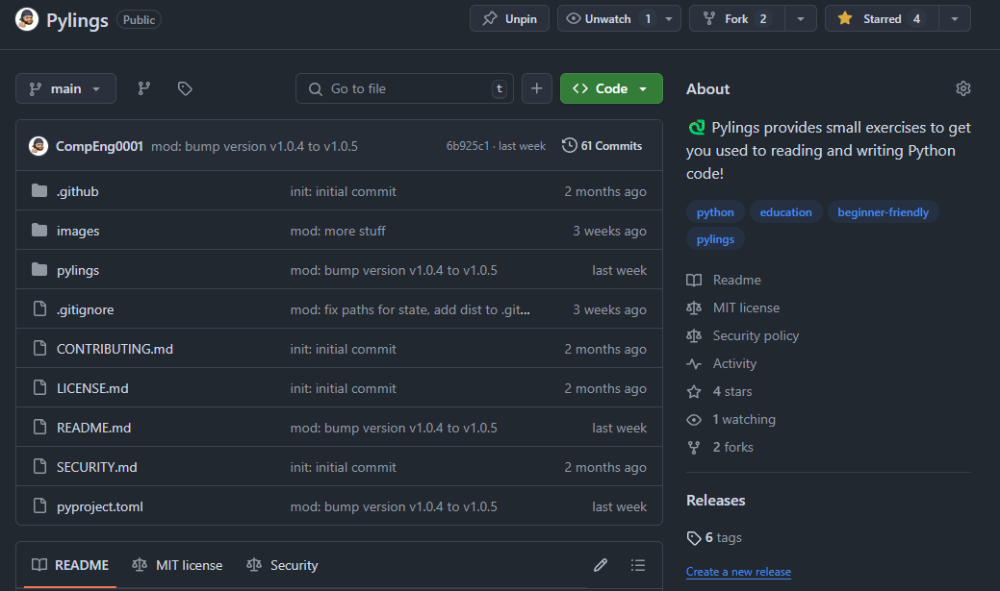

<div style="padding-top:100px">

## GitHub - What is it and features?

<div style="padding-top:40px">

- Web-based graphical user interface (GUI)
- Features
- Can act as a project manager
- Hosts Git repositories
- Secure with keys

</div>

---

<div style="padding-top:50px">

## Account creation

<div style="padding-top:30px">


*Hint: use your username@gre.ac.uk (you can register for education package later)

<!-- _footer: https://github.com/ -->
---

## Encryption - ed25519

- The ED25519 key fingerprint is a unique identifier for an SSH key, ensuring secure connections between clients and servers. It is generated using the SHA-256 hashing algorithm.

<div style="font-size:28px; padding-left:400px; padding-right:400px;">

```
$ ssh-keygen -t ed25519 -C "s.blair@gre.ac.uk"
Generating public/private ed25519 key pair.
Enter file in which to save the key (/home/user/.ssh/id_ed25519): 
Enter passphrase (empty for no passphrase): 
Enter same passphrase again: 
Your identification has been saved in /home/user/.ssh/id_ed25519
Your public key has been saved in /home/user/.ssh/id_ed25519.pub
The key fingerprint is:
SHA256:Ue/4v8XYf6tK8DZ1zN8KHZl1k+GJZNmjqTz3KbR1nCo s.blair@gre.ac.uk
The key's randomart image is:
+--[ED25519 256]--+
|       .+.o=.    |
|      + B.Eo     |
|     o B.+       |
|    . + X        |
|     o S o       |
|      = .        |
|     . .         |
|      .          |
|                 |
+----[SHA256]-----+
```


---

<div style="padding-top:50px">

## Syncing Git and GitHub


<div style="padding-left:180px;padding-top:100px">

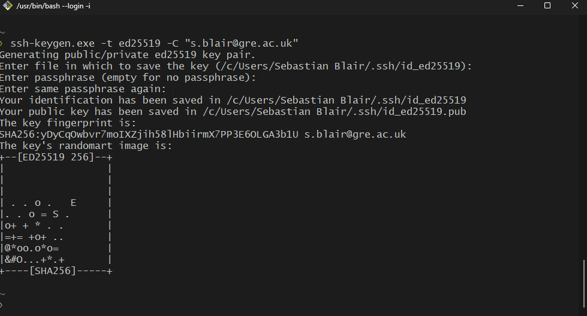 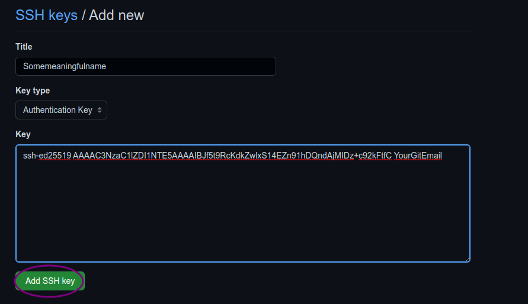

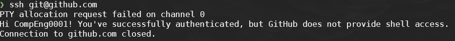

</div>

---

<!-- header: "" -->
<!-- _footer: "https://learngitbranching.js.org/" -->
<!-- class: lead -->

# Learning Git

