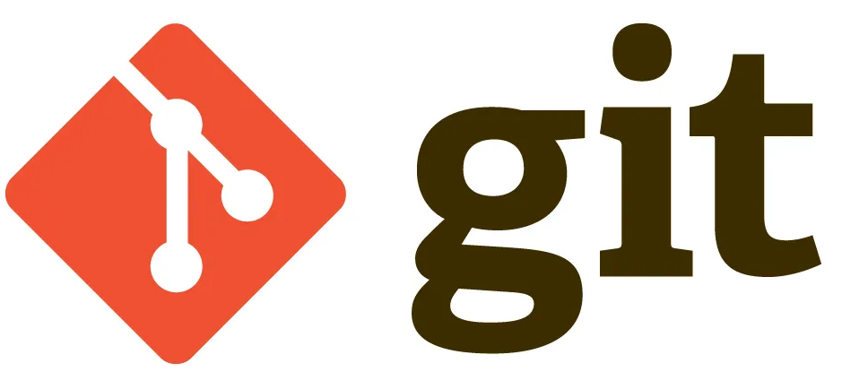
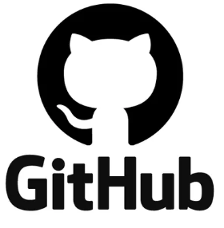
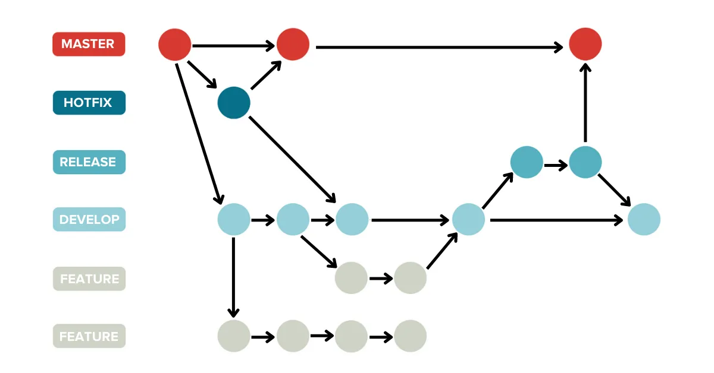
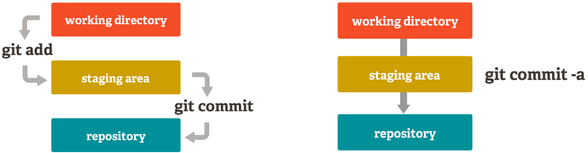
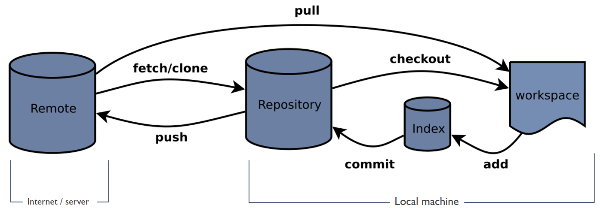
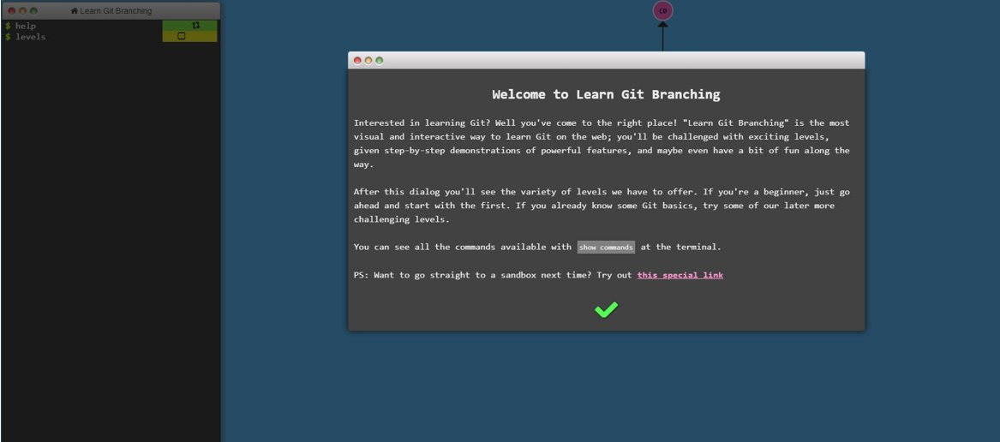

# Version Control Systems

    Course Code: ELEE1147
    
    Course Name: Programming for Engineers

    Credits: 15

    Module Leader: Seb Blair BEng(H) PGCAP MIET MIHEEM FHEA

---

## What are Version Control Systems (VCS)

- Tracking and managing changes: 
  - Work faster and more reliably
  
- Keeps track of all code modifications:
  - Specialised Database (Repository)
  
- Solves Common Team Problems:
  -  Conflicitng concurrent work, 
  - incompatiables due to concurrent working, 
  - having unstable releases

---

## Common Benefits of VCS

**Historical information​** : Looking at the history of changes it is a lot easier to find where bugs have originated. Also, it might be easier to find the right team member best suited to fix an error.​

**Branching​**: Working concurrently on multiple issues, without interference.​ Working on different types of releases.​

**Merging​** : Making sure that team members work does not interfere with each other.​

**Traceability​** : Team members work more fluently together.​

**Testing and Documentation​**: Comments for each change and its association help producing better documentation​. Creating tests is easier​.

---

## Types of VCS

- **Local**:
  - Creates a database on the your hardware ​
- **Centralised​**:
  - History of changes kept in a single database in a central server.​
  - Clients need to constantly communicate with the database and receive a partial working copy.​

- **Distributed​**:
  - Single database in a central server that is also distributed among all clients​
  - Each client has a full working copy of the repository​

---

## VCS - List

**Local Data Model**
- Revision Control System (RCS) [OS]
- Source Code Control System (SCCS) [OS]
- The Librarian [P]
- Panvalet [P]

**Client Server model**
- Concurrent Versions System [OS]
- Subversion (SVN) [OS]
- Vesta [OS]
- AccuRev [P]
- Autodesk Vault [P]
- CADES [P]
- ...
- Vault [P]
- Visual Source Safe [P]

---

## VCS - List

**Distrubted Model**

- ArX [OS]
- Bazaar [OS]
- BitKeeper [OS]
- Fossil [OS]
- Git [OS]
- GNU Arch [OS]
- Mecurial [OS]
- Code Co-op [P]
- Sun WorkShop TeamWare [P]
- Plastic SCM [P]
---

## Git Characteristics 

- A very popular VCS
- Performance
  - Better performance compared to competitors
  - Deals with the data in the file rather than the file properties
- Security
  - Designed to provide security
  - Uses SHA-256 encryption
- Flexibility
  - Non-linear development
  - Detailed log of information

--- 

## VCS Hosts - List

- TaraVault
- BitBucket
- SourceForg
- GitLab
- Gogs
- GitBucket
- GitHub
- AWS CodeCommit
- BeanStalk
- Phabricator
- ...many more
---

## GitHub - What is it and features?

- Web-based graphical user interface (GUI)
- Features
  - Can act as a project manager
  - Hosts Git repositories
  - Secure with keys

---

## Fundemental Git Functions

All commands are prepended with `git`

- `fetch`, `pull`: Get a working copy of a repository

- `add`,`commit`,`push`: Record a change or changes in at least one of the files stored in the repository.

- `branch`: Create a copy of a repository to be worked independently.

- `merge`: Collates changes of two different copies of a repository.

- `log`: Records information of each change within a repository

---

## Git - Branching

 - **Main**: The default development branch. Whenever you create a Git repository, a branch named "master" is created, and becomes the active branch. 

- **Develop**: This is another branch, which is a way to `edit/develop/test` code without changing the Master branch.

- **Topic**: A regular Git branch that is used by a developer to identify a conceptual line of development. 

---

## Git Commands Explained

`clone`​: Get a working copy of the repository​

`fetch`: Update the working copy of the repository without copying or removing any files.​

`pull`: Update the working copy of the repository with copying and removing any files necessary.​

`commit`: Update the working copy with all changes​

`push​`: to the main repository all changes that have been committed to the local working copy.​

`branch​`: Creates a copy of the repository that can be worked independently from the main branch​

`Merge`: Combine two copies of a repository.​ Conflicts may be present.​

---

## Git Repository Staging Area

As part of the version control features there is the **Staging Area**. ​

This is feature enables the developer to move files independently of each other  `git add <filename>` to the repository. Of course you can do this all in one go with `git commit -a​`

--- 

## Git Flow Diagram

---

## Git Beyond Software Development

- ​Developers​

- Marketing​

- Management​

  - Human Resources​

  - Product Management​

  - Project Budget​

- Customer Support​

---

## Learning Git

[https://learngitbranching.js.org/​](https://learngitbranching.js.org)

