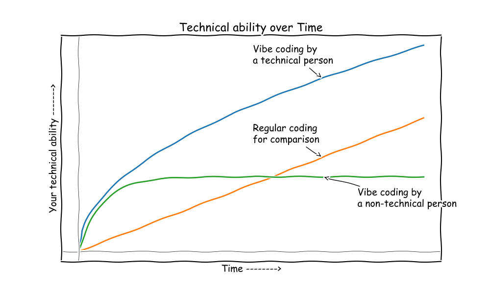
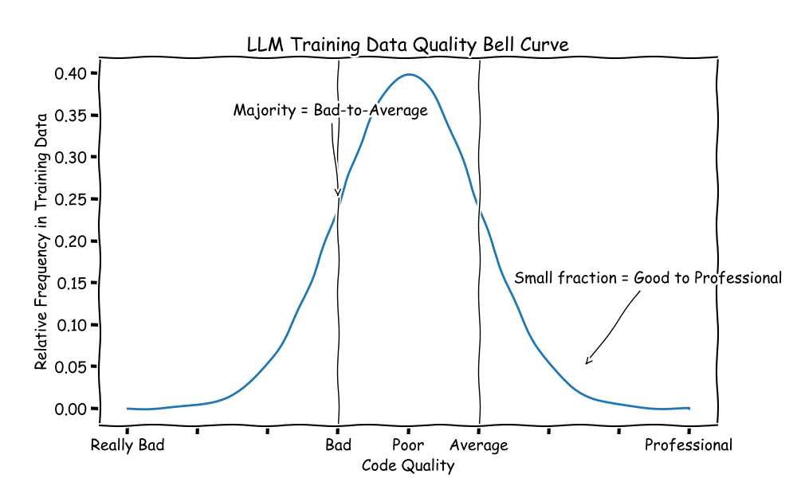
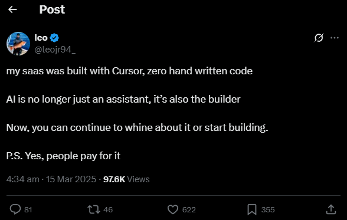
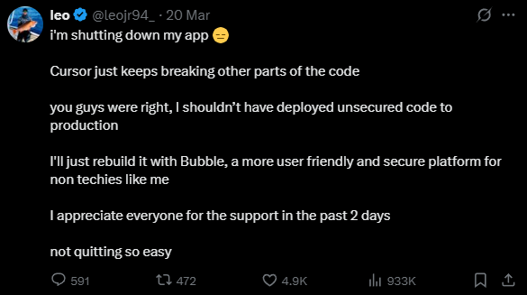
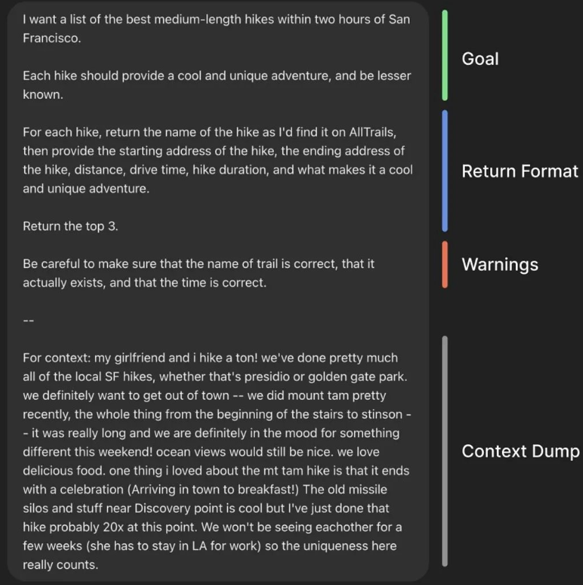
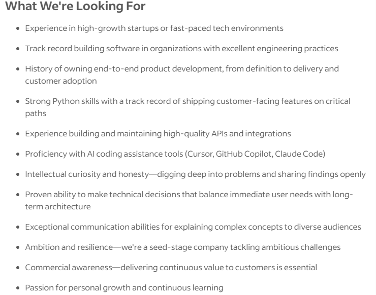
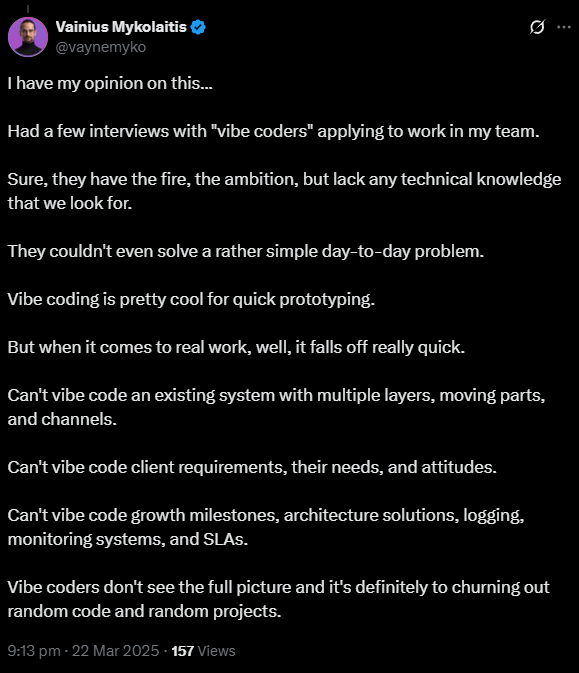

<!--
# Metadata
title: Vibe Programming
author: Seb Blair BEng(H) PGCAP MIET MIHEEM FHEA
description: Lecture slides on Vibe Programming.
keywords: module handbook
lang: en

# Slide styling
theme: uog-theme
_class: lead title
paginate: true
_paginate: false
transition: fade 250ms

style: |
  header em { font-style: normal; view-transition-name: header; }
  header strong { font-weight: inherit; view-transition-name: header2; }
  header:not:has(em) { view-transition-name: header; }
  header:not:has(strong) { view-transition-name: header; }
-->

<style scoped>
h1 {
  view-transition-name: header;
  display: flex;
  align-items: center;
  margin: 0 auto;
}
</style>

# Vibe Programming

<div align=center style="font-size:76px; padding-left:300px;padding-right:300px;" >

```py
module = Module(
    code="ELEE1147",
    name="Programming for Engineers",
    credits=15,
    module_leader="Seb Blair BEng(H) PGCAP MIET MIHEEM FHEA"
)
```

</div>

<!-- _footer: "[Download as a PDF](https://github.com/UniOfGreenwich/ELEE1147_Lectures/raw/main/content//c/Users/dev/Git/UoG/ELEE1147/Lectures/content/VibeProgramming/VibeProgramming.pdf)" -->

---

<style scoped>
h1 { view-transition-name: header2; }
</style>

<!-- header: "_Vibe Programming_" -->

## What is it?

<br>

> Vibe [programming]  (OpenAI, Andrej Karpathy, 2025)
> - It’s not too bad for throwaway weekend projects, but still quite amusing. I’m building a project or webapp, but it’s not really coding — I just **see stuff**, **say stuff**, **run stuff**, and **copy paste stuff**, and it _mostly_ works

<br>

- Vibe programming refers to AI-augmented or AI-dependent programming workflows where the user relies on natural language prompts, generated code snippets, and automated completions to develop software systems, often without fully understanding the underlying code mechanics.

<br>


---

## Do I need to learn programming?

<div class="columns-2" style="padding-top:150px">
<div>



</div>
<div>



</div>
</div>

---

<!-- class: lead -->

# Impacts | Costs 

<style scoped>
h1 { view-transition-name: header2; }
</style>

---

<!-- header: "_Vibe Programming_ > **Impacts | Costs**" -->


<div align="center" style="padding-top:150px">

| **Impact Area**    | **Why It’s Critical**                                                                   |
| ------------------ | --------------------------------------------------------------------------------------- |
| Energy consumption | Datacenter electricity use is skyrocketing; clean grid only partly mitigates the impact |
| Hardware emissions | Manufacturing GPUs, memory, and specialized hardware generates huge embodied emissions  |
| Water + resources  | Cooling, semiconductor fab, and supply chains intensify water and raw material demands  |
| Systemic rebound   | Efficiency alone leads to more demand, not less environmental impact                    |
| Governance gap     | Lack of unified regulation allows unchecked, unsustainable expansion                    |

</div>

<!-- _footer: https://mit-genai.pubpub.org/pub/8ulgrckc/release/2 -->

---


<div align="center" style="padding-top:150px">

| Year         | Global Datacenter Electricity Use (TWh/year)  | Datacenter Power Capacity (MW) |
| ------------ | --------------------------------------------- | ------------------------------ |
| 2010         | \~194 TWh                                     | 
| 2018         | \~204 TWh (despite \~6× increase in capacity) | 2,688 MW                       |
| 2022         | \~460 TWh                                     | 5,341 MW (nearly doubled)      |
| 2026 (proj.) | 620–1,050 TWh (base \~800 TWh)                | +12,000 MW (global)            |

<br>
<br>

</div>

Google reported in 2021 that its U.S. datacenters consumed 12.7 billion liters of water

<!-- _footer: https://mit-genai.pubpub.org/pub/8ulgrckc/release/2 -->

---

<!-- header: "Vibe Programming > Impacts | Costs" -->

<div align="center" style="padding-top:150px">

| Model          | Approximate Training Energy Use                     |
| -------------- | --------------------------------------------------- |
| GPT-3          | \~1,287 MWh (≈ energy use of \~120 U.S. homes/year) |
| GPT-4 (likely) | Higher (exact not disclosed, but >2× GPT-3 likely)  |

<br>
<br>

| Unit                                   | CO₂ Emissions (Estimate) |
| -------------------------------------- | ------------------------ |
| Single GPT query (simple)              | \~2–4 g CO₂              |
| Single GPT query (complex, multi-turn) | \~10–50 g CO₂            |

</div>

<!-- _footer: https://mit-genai.pubpub.org/pub/8ulgrckc/release/2 -->

---

<!-- header: "Vibe Programming" -->
<!-- class: lead -->

# Costly Errors


<style scoped>
h1 { view-transition-name: header2; }
</style>

---

<!-- header: "_Vibe Programming_ > **Costly Errors**" -->

<div class="columns-2" style="padding-top:7s0px">
<div>

> Last week, we asked Devin to make a change. 
> It added an event on the banner component
> mount, which caused 6.6M posthog events in
> one week, which will cost us $733. 
> Devin costs $500 + $733 = $1273
>
> Lesson - Review AI-generated code multiple times
>
> Anurag Bhagsain (2025)

</div>
<div style="padding-top:90px">


</div>
</div>

<!-- _footer: https://x.com/abhagsain/status/1876362355870994538 -->

---

<!-- header: "Vibe Programming > Costly Errors" -->

<div class="columns-2" style="padding-top:10px">
<div style="padding-top:200px">



</div>
<div>




<!-- _footer: https://x.com/leojr94_/status/1901560276488511759 -->

</div>
</div>

---

<div style="padding-top:30px;padding-bottom:3px">

> Prompt: here is my python script, I want to change code base to rust: [Copilot]

</div>

<div class="columns-2" style="display: flex; gap: 2rem; --col-1-grow: 1; --col-2-grow: 1.5;">
<div style="flex: var(--col-1-grow) 1 0; min-width: 0; font-size: 28px;">

**Python**

```py
import time

password = input('Enter Password'):
start = time.time()

chars = 'abcdefghijklmnopqrstuvwxyz'
guess = []
for val in range(5):
  a = [i for i in chars]
  for y in range(val):
    a = [x+i for i in chars for x in a]
  guess = guess+a

  if password in guess:
    break
end = time.time()
clock = str(end - start)

print('Your password: ' + password)
print('Time taken: ' + clock)
```
</div>

<div style="flex: var(--col-2-grow) 1 0; min-width: 0; font-size: 30px;">

**rust**

```rust
use std::time::Instant;
use std::io::{self, Write};

fn main() {
    print!("Enter Password: ");
    io::stdout().flush().unwrap();
    let mut password = String::new();
    io::stdin().read_line(&mut password).unwrap();
    let password = password.trim();

    let start = Instant::now();

    let chars = "abcdefghijklmnopqrstuvwxyz";
    let mut guess = Vec::new();

    for val in 0..5 {
        let mut a: Vec<String> = chars.chars().map(|c| c.to_string()).collect();
        for _ in 0..val {
            a = a.iter().flat_map(|x| chars.chars().map(move |c| format!("{}{}", x, c))).collect();
        }
        guess.extend(a);

        if guess.contains(&password.to_string()) {
            break;
        }
    }

    let duration = start.elapsed();
    println!("Your password: {}", password);
    println!("Time taken: {:?}", duration);
}
```

</div>
</div>


---


<div style="padding-bottom:100px">

## Limits

</div>

<div>

- Generated code ≠ correct code.

<br>

- The models don’t reason — they pattern-match statistically.

<br>

- Warning: AI-generated code must be reviewed, tested, and integrated responsibly. Blind trust leads to failure.

</div>

---

<!-- header: "Vibe Programming" -->
<!-- class: lead -->

# Prompt Engineering

<style scoped>
h1 { view-transition-name: header2; }
</style>


---

<!-- header: "_Vibe Programming_ > **Prompt Engineering**" -->

<div class="columns-2">
<div style="padding-top:300px">

## The Anatomy of an o1 Prompt

- Set clear context
- Give specific instructions
- Define the output format
- Include warnings (what to avoid)
- Use a context dump when needed

</div>
<div>



</div>
</div>

<!-- _footer: https://x.com/gdb/status/1878489681702310392 -->

---
<!-- header: "Vibe Programming > Prompt Engineering" -->

- **Business & Marketing**
  - Old Prompt: “Give me some marketing ideas.”
  - o1 Prompt: “You are a marketing consultant for a tech startup launching a new fitness app. Provide three innovative campaign ideas with target demographics, a brief budget estimate, and potential ROI. Format your answer in bullet points.”
- **Education & E-Learning**
  - Old Prompt: “Explain photosynthesis.”
  - o1 Prompt: “Act as a middle-school science teacher preparing a 10-minute lesson on photosynthesis. Include a simple experiment students can do at home, three key vocabulary words, and a 5-question quiz at the end. Keep the tone friendly and age-appropriate.”
- **Creative Writing**
  - Old Prompt: “Write a short story about dragons.”
  - o1 Prompt: “Write a 300-word short story set in a futuristic city, featuring dragons that coexist with humans. Focus on the emotional tension between humans and dragons. Conclude with a cliffhanger.”

---


---

<!-- header: "Vibe Programming" -->
<!-- class: lead -->

<style scoped>
h1 { view-transition-name: header2; }
</style>

# Job Prospects

---

<!-- header: "_Vibe Programming_ > **Job Prospects**" -->

<div class="columns-2" style="padding-top:10px">
<div style="padding-top:10px">

<div style="font-size:27px">

- **Staff AI Engineer**
  - Fifth Dimension AI | London W1D | Hybrid work
  - £100,000 to £120,000

  

</div>

</div>
<div style="padding-top:170px">



</div>
</div>

<!-- _footer: https://uk.indeed.com/q-vibe-coding-jobs-jobs.html?vjk=e5cfbcfb29ce9a0e -->

---

<!-- header: "Vibe Programming" -->

<div style="padding-bottom:100px">

## Takeaways

</div>

<div>

<br>

- Vibe coding can speed up development, especially for simple tasks.

<br>

- It is not a substitute for technical understanding.

<br>

- To use it effectively, you must combine human expertise with AI tools.

<br>

- Always review and test the generated code.

</div>